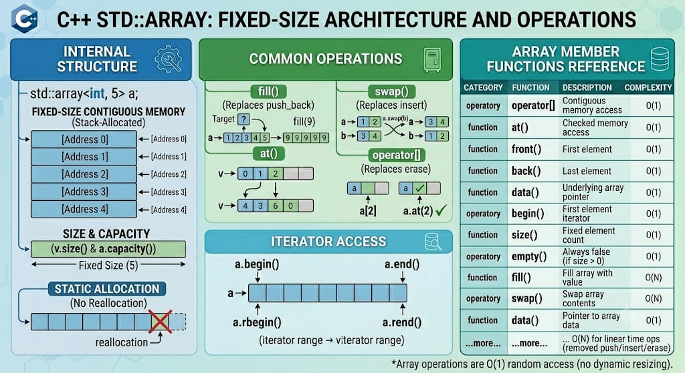

# ARRAY

`std::array<T, N>` is a fixed-size sequence container from the C++ Standard Library that encapsulates fixed-size arrays. Unlike `std::vector`, it stores elements contiguously inside the object itself without managing dynamic allocation. It combines the performance and efficiency of a C-style array with the standard interface benefits of an STL container, such as bounds checking, iterators, and copy/move semantics.

**Header:** `<array>`

**Template:** `template< class T, std::size_t N > struct array;`



## High-level characteristics

- **Contiguous storage**: Elements are stored in a single contiguous block of memory directly inside the `std::array` object.
- **Fixed size at compile time**: The size `N` is part of the type signature and cannot change at runtime. No allocation overhead or resizing capacity exists.
- **Zero abstraction penalty**: Provides performance identical to a native C-style array (`T arr[N]`) but adds explicit safety features.
- **Value semantics**: Unlike C-style arrays, `std::array` can be natively copied, moved, passed by value, or assigned to another `std::array` of the exact same type and size.
- **Aggregate initialization**: Implemented as an aggregate type, allowing direct brace-initialization of its members.

## How it works internally

Internally, `std::array` typically wraps a standard raw C-style array as its sole member variable:
- **No pointer indirection**: An instance of `std::array<int, 5>` reserves exactly `5 * sizeof(int)` bytes on the stack (or wherever the container itself is declared).
- **Data layout**: There are no hidden tracking pointers (`begin`, `end`, or `capacity`). The memory footprint is minimal and completely static.

**Size vs Max size**:
- For `std::array`, `size()` and `max_size()` always return `N`.

**Exception safety**: 
- Modifying operations (`fill`, `swap`) provide a basic or strong guarantee depending entirely on the exception safety of the element type `T`'s copy/move operations.
- Element access via `.at()` provides a strong exception guarantee and throws `std::out_of_range` if the index violates runtime bounds.

## Complexity guarantees

| Operation | Complexity |
|-----------|-----------|
| Access by index (`operator[]`, `at`) | O(1) |
| Access front/back (`front`, `back`) | O(1) |
| `fill` | O(N) (linear time to assign value to all elements) |
| `swap` | O(N) (linear time; swaps every element individually) |
| `size`, `max_size`, `empty` | O(1) |

## Member functions and operators

### Constructors

Because `std::array` is an aggregate type, it does not provide explicit constructor overloads. Instead, it relies on aggregate initialization syntax.

```cpp
// (1) Implicitly declared default constructor/initialization
array<T, N> arr;

// (2) Aggregate/Brace initialization
array<T, N> arr = { val1, val2, ... };
```

**Examples:**
```cpp
std::array<int, 3> a;                  // Uninitialized (contains garbage values if local)
std::array<int, 3> b = {};             // Value-initialized: {0, 0, 0}
std::array<int, 3> c = {1, 2, 3};      // Fully initialized: {1, 2, 3}
std::array<int, 5> d = {1, 2};         // Partially initialized: {1, 2, 0, 0, 0}
std::array<int, 3> e = c;              // Native copy operation supported
```

### Destructor

```cpp
~array(); // Automatically invokes destructors for all N elements sequentially
```

### Assignment operators

```cpp
array& operator=( const array& other );     // Copy assignment
array& operator=( array&& other );          // Move assignment (element-wise move)
```

**Examples:**
```cpp
std::array<int, 3> a = {1, 2, 3};
std::array<int, 3> b;
b = a;                                      // Element-wise copy assignment
b = std::move(a);                           // Element-wise move assignment
```

### Element access

```cpp
T& at( size_type pos );                     // Bounds checking, throws std::out_of_range
const T& at( size_type pos ) const;

T& operator[]( size_type pos );             // Unchecked access (faster, undefined if out of bounds)
const T& operator[]( size_type pos ) const;

T& front();                                 // Reference to first element (undefined if N == 0)
const T& front() const;

T& back();                                  // Reference to last element (undefined if N == 0)
const T& back() const;

T* data() noexcept;                         // Pointer to underlying raw array buffer
const T* data() const noexcept;
```

**Examples:**
```cpp
std::array<int, 3> arr = {10, 20, 30};
int x = arr[1];                             // 20 (unchecked)
int y = arr.at(2);                          // 30 (checked)
int z = arr.front();                        // 10
int w = arr.back();                         // 30
int* raw_ptr = arr.data();                  // Pointer to array memory, ideal for C-style functions
```

### Iterators

```cpp
iterator begin() noexcept;                  // Iterator to beginning
const_iterator begin() const noexcept;
const_iterator cbegin() const noexcept;

iterator end() noexcept;                    // Iterator to end (one-past-last)
const_iterator end() const noexcept;
const_iterator cend() const noexcept;

reverse_iterator rbegin() noexcept;         // Reverse iterator to end
const_reverse_iterator rbegin() const noexcept;
const_reverse_iterator crbegin() const noexcept;

reverse_iterator rend() noexcept;           // Reverse iterator to beginning
const_reverse_iterator rend() const noexcept;
const_reverse_iterator crend() const noexcept;
```

**Examples:**
```cpp
std::array<int, 4> arr = {1, 2, 3, 4};

// Forward iteration
for(auto it = arr.begin(); it != arr.end(); ++it) {
    std::cout << *it << ' ';  // 1 2 3 4
}

// Reverse iteration
for(auto it = arr.rbegin(); it != arr.rend(); ++it) {
    std::cout << *it << ' ';  // 4 3 2 1
}

// Range-based for loop
for(const auto& x : arr) {
    std::cout << x << ' ';    // 1 2 3 4
}
```

### Capacity

```cpp
constexpr bool empty() const noexcept;      // Checks if N == 0
constexpr size_type size() const noexcept;  // Always returns N
constexpr size_type max_size() const noexcept; // Always returns N
```

**Examples:**
```cpp
std::array<int, 5> arr;
std::cout << arr.size();     // 5
std::cout << arr.max_size(); // 5

std::array<int, 0> empty_arr;
if (empty_arr.empty()) {
    // True because size template argument N is 0
}
```

### Modifiers

#### fill() — Fill array with value

```cpp
void fill( const T& value ); // Assigns the specified value to all elements in the container
```

**Examples:**
```cpp
std::array<int, 4> arr;
arr.fill(42);                // arr = {42, 42, 42, 42}
```

#### swap() — Exchange contents

```cpp
void swap( array& other ) noexcept(/* conditional */); // Linear swapping of all individual items
```

**Examples:**
```cpp
std::array<int, 3> a = {1, 2, 3};
std::array<int, 3> b = {7, 8, 9};
a.swap(b);                   // a = {7, 8, 9}, b = {1, 2, 3}
```

### Comparison operators

```cpp
bool operator==(const array& lhs, const array& rhs); // Element-wise equality
bool operator!=(const array& lhs, const array& rhs); // Element-wise inequality
bool operator<(const array& lhs, const array& rhs);  // Lexicographical comparison
bool operator<=(const array& lhs, const array& rhs);
bool operator>(const array& lhs, const array& rhs);
bool operator>=(const array& lhs, const array& rhs);
```

**Examples:**
```cpp
std::array<int, 3> a = {1, 2, 3};
std::array<int, 3> b = {1, 2, 3};
std::array<int, 3> c = {1, 2, 4};

if (a == b) { std::cout << "equal\n"; }       // True
if (a < c)  { std::cout << "less\n"; }        // True
```

### Non-member functions

```cpp
// (1) Tuple-like element access
template< std::size_t I, class T, std::size_t N >
constexpr T& get( std::array<T, N>& arr ) noexcept;

// (2) Creates a std::array from variable arguments (C++20)
template< class T, std::size_t N >
constexpr std::array<std::remove_cv_t<T>, N> to_array( T (&a)[N] );
```

**Examples:**
```cpp
std::array<int, 3> arr = {10, 20, 30};
int first = std::get<0>(arr);                 // Extract element 0 at compile time (10)

auto auto_arr = std::to_array({1, 2, 3, 4});  // Deduces std::array<int, 4> (C++20)
```

## Iterator and reference invalidation rules
- Because std::array has a strict fixed-size structure, its reference invalidation properties are highly stable:

| Operation | Invalidation |
|-----------|---|
| `Any access/read` | Never invalidates any iterators, references, or pointers. |
| `swap` | Iterators and references remain valid but shift association to the alternative container's matching index element. |
| `fill` | Never invalidates any iterators or references (values are overwritten in-place).   |
| `Destruction` | All elements are destroyed; consequently, all iterators, references, and pointers are invalidated. |
  
**Key takeaway:** Pointers, references, and iterators to a std::array element stay completely active and secure for the entire scope/lifetime of the array object itself.

## Typical pitfalls and best practices

1. **Stack overflow hazards**: Avoid creating massive instances (e.g., `std::array<int, 1000000>`) inside local scopes, as this risks blowing past the stack size limit. Use `std::vector` for large collections.

2. **No dynamic adjustments** Functions like `push_back`, `pop_back`, `insert`, or `erase` do not exist. Do not choose `std::array` if your tracking metrics require a variable number of runtime additions.

3. **Missing default initialization caution**: Local primitive instances (like `std::array<int, 10> local_arr;`) contain random garbage memory elements unless explicitly zeroed out or aggregate-initialized via `= {}`.

4. **Verify types on swap**: You can only swap arrays that share both identical matching types T and exact sizing variables `N`.

## Common idioms and patterns

### Compile-time structured binding extraction

```cpp
std::array<int, 3> point = {10, 20, 30};
auto [x, y, z] = point; // Deconstruct items seamlessly using structured bindings (C++17)
```

### Safe raw array handoffs to Legacy APIs

```cpp
void process_c_matrix(const float* buffer, size_t dimensions);

std::array<float, 6> projection_data = {1.0f, 0.0f, 5.5f, 2.1f, 0.0f, 1.0f};
process_c_matrix(projection_data.data(), projection_data.size());
```

### Constant expression tables (constexpr lookups)
```cpp
constexpr std::array<int, 4> generate_lookup_table() {
    return {0, 1, 4, 9}; // Perfectly evaluated entirely at compile time
}
constexpr auto square_table = generate_lookup_table();
```

## Real-world use cases

- **Fixed geometric layouts**: Storing static dimensional components such as 3D Coordinates (x,y,z), transformation matrices (4×4), or color channel variants (RGBA).
- **Embedded firmware pipelines**: Applications tracking predefined resource structures where runtime allocations via heap components are entirely restricted.
- **State tracking flags**: Fixed enum lookup maps, transition validation arrays, or localized configurations.
- **High-speed algorithm caching**: Performance-critical cache-friendly lookups where dynamic heap-allocation delays from `std::vector` allocations cannot be tolerated.


## Useful headers and related features

| Header | Functionality |
|--------|---|
| `<array>` | Fixed-size array container |
| `<tuple>` | Holds utility methods like `std::get` for working with array fields |
| `<utility>` | Provides structured helper tools, swapping protocols, and structural types |

## Full example program

```cpp
#include <iostream>
#include <array>
#include <algorithm>
#include <numeric>

int main() {
    // Create and populate fixed array via aggregate initializers
    std::array<int, 5> arr = {40, 10, 50, 20, 30};

    std::cout << "Initial array values: ";
    for (auto x : arr) std::cout << x << ' ';
    std::cout << "\nSize: " << arr.size() << ", Max Size: " << arr.max_size() << '\n';

    // Direct element modifications and checked vs unchecked modifications
    arr[0] = 5;
    arr.at(1) = 15;
    
    std::cout << "After explicit updates: ";
    for (auto x : arr) std::cout << x << ' ';
    std::cout << '\n';

    // Sorting array contents using algorithm iterators
    std::sort(arr.begin(), arr.end());
    std::cout << "Sorted sequence: ";
    for (auto x : arr) std::cout << x << ' ';
    std::cout << '\n';

    // Sum calculation via std::accumulate
    int sum = std::accumulate(arr.begin(), arr.end(), 0);
    std::cout << "Sum calculation: " << sum << '\n';

    // Bulk overwrite manipulation via fill
    arr.fill(7);
    std::cout << "After array fill: ";
    for (auto x : arr) std::cout << x << ' ';
    std::cout << '\n';

    return 0;
}
```

**Output:**
```
Initial array values: 40 10 50 20 30 
Size: 5, Max Size: 5
After explicit updates: 5 15 50 20 30 
Sorted sequence: 5 15 20 30 50 
Sum calculation: 120
After array fill: 7 7 7 7 7
```

---

