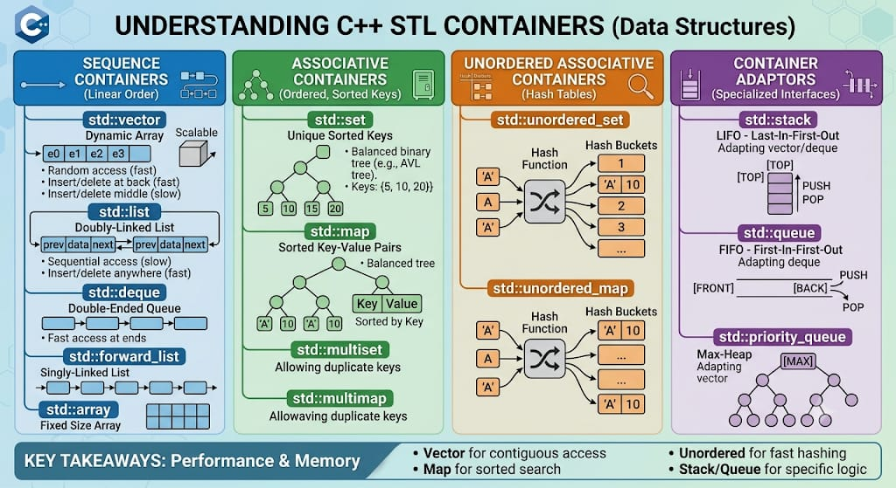

# STL Containers

## Definition

A **Container** in C++ Standard Template Library (STL) is a holder object that stores collections of other objects. Containers manage storage space for their elements and provide access mechanisms and operations to manipulate the stored objects. They are template classes that provide various data structures optimized for different use cases.

## Key Characteristics of Containers

- **Template Classes**: Generic and work with any data type
- **Dynamic Memory Management**: Handle memory allocation and deallocation automatically
- **Standard Interface**: Provide consistent methods and iterators for data access
- **Performance Optimized**: Each container is optimized for specific operations
- **STL Compatibility**: Work seamlessly with STL algorithms and iterators

## Types of STL Containers

STL containers are categorized into three main types based on their functionality and access patterns:

### 1. **Sequence Containers**
Ordered collections that maintain the sequence of elements as inserted. Elements are accessed by position/index.

### 2. **Associative Containers**
Collections that store elements in a sorted order based on keys. Provide fast lookup based on key values.

### 3. **Unordered Associative Containers**
Collections that store elements in an unordered manner using hash tables. Provide average O(1) lookup time.

### 4. **Container Adapters**
Specialized containers that provide restricted interfaces built on top of other containers.

---

## 

---

## Complete List of STL Containers

### **SEQUENCE CONTAINERS**
- Sequence containers implement data structures which can be accessed sequentially. 

| Container | Description |
|-----------|-------------|
| **vector** | Dynamic array that grows/shrinks automatically; provides random access with O(1) complexity |
| **deque** | Double-ended queue allowing efficient insertion/deletion at both front and back |
| **list** | Doubly-linked list providing efficient insertion/deletion at any position with O(1) complexity |
| **forward_list** | (Added in C++11) Singly-linked list consuming less memory than list but with unidirectional traversal |
| **array** | (Added in C++11) Fixed-size container wrapper for C-style arrays with STL interface and bounds checking |
| **inplace_vector** | (Added in C++26) Dynamically-resizable array with contiguous inplace storage with fixed capacity |
| **hive** | (Added in C++26) Automatically manages its storage in multiple memory blocks (element blocks). sequence container that provides constant-time insertion and erasure operations. |

### **ASSOCIATIVE CONTAINERS**
- Associative containers implement sorted data structures that can be quickly searched (O(log n) complexity). 

| Container | Description |
|-----------|-------------|
| **set** | Sorted collection of unique elements; uses balanced binary search tree (typically Red-Black tree) |
| **multiset** | Sorted collection allowing duplicate elements; similar to set but permits multiple instances |
| **map** | Sorted collection of key-value pairs with unique keys; fast lookup by key with O(log n) complexity |
| **multimap** | Sorted collection of key-value pairs allowing duplicate keys; enables multiple values per key |

### **UNORDERED ASSOCIATIVE CONTAINERS**
- Unordered associative containers implement unsorted (hashed) data structures that can be quickly searched (O(1) average, O(n) worst-case complexity).
- Added in C++11

| Container | Description |
|-----------|-------------|
| **unordered_set** | Hash table-based collection of unique elements with average O(1) lookup and insertion |
| **unordered_multiset** | Hash table-based collection allowing duplicate elements with unordered storage |
| **unordered_map** | Hash table-based key-value pairs with unique keys providing fast average O(1) access |
| **unordered_multimap** | Hash table-based key-value pairs allowing duplicate keys with unordered arrangement |

### **CONTAINER ADAPTERS**
- Container adaptors provide a different interface for sequential containers. 

| Container | Description |
|-----------|-------------|
| **stack** | LIFO (Last-In-First-Out) adapter built on top of deque/vector/list for push/pop operations |
| **queue** | FIFO (First-In-First-Out) adapter built on top of deque/list for enqueue/dequeue operations |
| **priority_queue** | Priority-based queue adapter that always retrieves the highest priority element first |

- *Below containers are added in C++23*

| Container | Description |
|-----------|-------------| 
| **flat_set** | Associative container that stores a sorted set of unique objects of type Key. |
| **flat_multiset** | Stores a sorted set of objects of type Key. Unlike flat_set, multiple keys with equivalent values are allowed. |
| **flat_map** | Associative container that contains key-value pairs with unique keys. |
| **flat_multimap** | Contains key-value pairs, while permitting multiple entries with the same key value. |

---

## Container Selection Guide

### Choose **vector** when:
- You need random access to elements
- Most operations are insertions/deletions at the end
- Memory efficiency is important

### Choose **deque** when:
- You need efficient insertion/deletion at both ends
- You need random access
- You want better cache locality than list

### Choose **list** when:
- You frequently insert/delete elements in the middle
- You don't need random access
- You prefer O(1) insertion/deletion anywhere

### Choose **set/map** when:
- You need sorted data
- You need fast searches with O(log n) complexity
- You need unique keys (set/map) or duplicate keys (multiset/multimap)

### Choose **unordered_set/unordered_map** when:
- You need average O(1) lookup time
- Order of elements doesn't matter
- You're performing frequent searches

### Choose **stack** when:
- You need LIFO data structure (undo/redo operations)
- You want restricted access (top element only)

### Choose **queue** when:
- You need FIFO data structure (task scheduling)
- You want restricted access (front and back only)

### Choose **priority_queue** when:
- You need elements retrieved in priority order
- You're implementing algorithms like Dijkstra or Huffman coding

