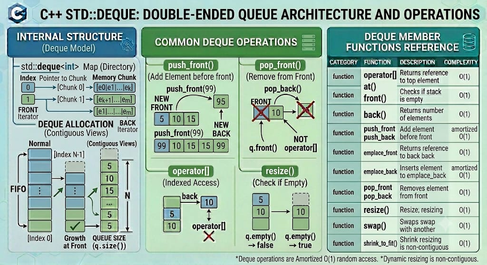

# DEQUE

`std::deque` (double-ended queue) is an indexed sequence container from the C++ Standard Library that allows for fast insertion and deletion at both its beginning and its end. Unlike `std::vector`, the elements of a deque are not stored in a single contiguous memory block; instead, they are typically managed via a sequence of individually allocated, fixed-size arrays. The container provides sub-constant random access to elements and handles automatic dynamic memory reallocation without requiring element copying during expansion at the boundaries.

**Header:** `<deque>`

**Template:** `template< class T, class Allocator = std::allocator<T> > class deque;`



## High-level characteristics

- **Non-contiguous chunked storage**: Elements are stored in a series of fixed-size memory chunks rather than one large continuous block.
- **Fast boundary operations**: Provides strict $O(1)$ performance guarantees for insertions and deletions at both the front and the back (`push_front`, `pop_front`, `push_back`, `pop_back`).
- **No capacity or reserve mechanics**: A deque does not have a `capacity()` or `reserve()` member function. It allocates new chunks on-demand as elements expand outward.
- **Sub-constant random access**: Elements are accessible by index via `operator[]` in $O(1)$ time, but it requires two pointer dereferences internally (one to look up the chunk map, and another to access the item within that chunk).
- **Favorable iterator validation**: Inserting at either end of a `std::deque` invalidates its iterators but leaves pointers and references to existing elements completely valid.

## How it works internally

Internally, a typical implementation of `std::deque` maintains a central control structure often called the **Map** (not to be confused with `std::map`):
- **Chunk Map**: A dynamic array of pointers where each pointer references an individually allocated block (chunk) of a fixed size (e.g., capable of holding a specific number of elements of type `T`).
- **Boundary Tracking**: The deque maintains pointers tracking the first active element in the first active chunk, and one-past-the-last element in the final active chunk.

When you `push_front()` or `push_back()` and the boundary chunk runs out of slots, the deque allocates a brand new fixed-size chunk and attaches its address to the central chunk map. If the central map array itself runs out of space, only the map array of pointers is reallocated and copied, leaving the large underlying data elements entirely untouched in their original memory chunks.

**Exception safety**:
- Operations that allocate chunks (`push_back`, `push_front`, `insert`, `emplace`) may throw `std::bad_alloc`.
- Deque provides a strong exception guarantee for boundary insertions: if an exception is thrown during `push_back` or `push_front`, the container is rolled back to its exact original state.

## Complexity guarantees

| Operation | Complexity |
|-----------|-----------|
| Access by index (`operator[]`, `at`) | O(1) |
| `push_front` / `pop_front` | O(1) |
| `push_back` / `pop_back` | O(1) |
| `insert` / `erase` at arbitrary position | O(N) (linear time, but optimized to shift minimal elements towards the closest boundary) |
| `clear` | O(N) (calls destructors and releases chunk blocks) |
| `size`, `empty` | O(1) |

## Member functions and operators

### Constructors

```cpp
deque();                                            // (1) empty deque
deque(size_type count);                             // (2) count default-constructed elements
deque(size_type count, const T& value);             // (3) count copies of value
template<class InputIt>
deque(InputIt first, InputIt last);                 // (4) range [first, last)
deque(const deque& other);                          // (5) copy constructor
deque(deque&& other) noexcept;                      // (6) move constructor
deque(std::initializer_list<T> init);              // (7) initializer list
```

**Examples:**
```cpp
std::deque<int> a;                            // empty
std::deque<int> b(5);                         // {0, 0, 0, 0, 0}
std::deque<int> c(5, 42);                     // {42, 42, 42, 42, 42}
std::deque<int> d(c.begin(), c.end());        // copy from range
std::deque<int> e(std::move(b));              // move from b
std::deque<int> f = {1, 2, 3};                // initializer list
```

### Destructor

```cpp
~deque();  // destroys all elements and deallocates all allocated chunk blocks
```

### Assignment operators

```cpp
deque& operator=(const deque& other);               // copy assignment
deque& operator=(deque&& other) noexcept;            // move assignment
deque& operator=(std::initializer_list<T> ilist);   // initializer list assignment
```

**Examples:**
```cpp
std::deque<int> d1 = {1, 2, 3};
std::deque<int> d2;
d2 = d1;                                      // copy
d2 = std::move(d1);                           // move
d2 = {4, 5, 6};                               // initializer list
```

### assign() — Replace contents

```cpp
void assign(size_type count, const T& value);           // fill assign
template<class InputIt>
void assign(InputIt first, InputIt last);               // range assign
void assign(std::initializer_list<T> ilist);            // initializer list assign
```

**Examples:**
```cpp
std::vector<int> v;
v.assign(3, 7);                                 // {7, 7, 7}
std::vector<int> src = {1, 2, 3};
v.assign(src.begin(), src.end());               // {1, 2, 3}
v.assign({10, 20, 30});                         // {10, 20, 30}
```

### Element access

```cpp
T& at(size_type pos);                   // bounds checking, throws std::out_of_range
const T& at(size_type pos) const;

T& operator[](size_type pos);           // unchecked access (faster, undefined if out of bounds)
const T& operator[](size_type pos) const;

T& front();                             // reference to first element (undefined if empty)
const T& front() const;

T& back();                              // reference to last element (undefined if empty)
const T& back() const;
```
*-Note: unlike vector and array, std::deque does not provide a data() member function because its memory footprint is non-contiguous.*

**Examples:**
```cpp
std::deque<int> d = {10, 20, 30};
int x = d[1];                           // 20 (unchecked)
int y = d.at(2);                        // 30 (checked)
int z = d.front();                      // 10
int w = d.back();                       // 30
```

### Iterators

```cpp
iterator begin() noexcept;              // iterator to beginning
const_iterator begin() const noexcept;
const_iterator cbegin() const noexcept;

iterator end() noexcept;                // iterator to end (one-past-last)
const_iterator end() const noexcept;
const_iterator cend() const noexcept;

reverse_iterator rbegin() noexcept;     // reverse iterator to end
const_reverse_iterator rbegin() const noexcept;
const_reverse_iterator crbegin() const noexcept;

reverse_iterator rend() noexcept;       // reverse iterator to beginning
const_reverse_iterator rend() const noexcept;
const_reverse_iterator crend() const noexcept;
```

**Examples:**
```cpp
std::deque<int> d = {1, 2, 3, 4, 5};

// Forward iteration
for(auto it = d.begin(); it != d.end(); ++it) {
    std::cout << *it << ' ';  // 1 2 3 4 5
}

// Reverse iteration
for(auto it = d.rbegin(); it != d.rend(); ++it) {
    std::cout << *it << ' ';  // 5 4 3 2 1
}
```

### Capacity

```cpp
bool empty() const noexcept;              // check if size == 0
size_type size() const noexcept;          // number of elements
size_type max_size() const noexcept;      // maximum theoretical size
void shrink_to_fit();                     // request to reduce memory usage by freeing unused chunks
```

**Examples:**
```cpp
std::deque<int> d = {1, 2, 3};
std::cout << d.size();                    // 3

if (!d.empty()) {
    d.shrink_to_fit();                    // drops completely unallocated boundary memory chunks
}
```

### Modifiers

#### clear() — Remove all elements

```cpp
void clear() noexcept;  // clears content, calls destructors, releases chunk space
```

#### push_back() / pop_back() — Add/remove at end

```cpp
void push_back(const T& value);     // copy element to end
void push_back(T&& value);          // move element to end
void pop_back();                    // remove last element (undefined if empty)
```

#### push_front() / pop_front() — Add/remove at front

```cpp
void push_front(const T& value);    // copy element to front
void push_front(T&& value);         // move element to front
void pop_front();                   // remove first element (undefined if empty)
```

**Examples:**
```cpp
std::deque<std::string> dq;
dq.push_back("Center");
dq.push_front("Front");             // {"Front", "Center"}
dq.push_back("Back");               // {"Front", "Center", "Back"}
dq.pop_front();                     // {"Center", "Back"}
dq.pop_back();                      // {"Center"}
```

#### emplace_back() / emplace_front() — Construct in-place at boundaries

```cpp
template<class... Args>
reference emplace_back(Args&&... args);   // construct at the end via perfect forwarding
template<class... Args>
reference emplace_front(Args&&... args);  // construct at the front via perfect forwarding
```

**Benefits:** Avoids temporary construction and unnecessary copy/move.

**Examples:**
```cpp
struct Task {
    int id; std::string desc;
    Task(int id, std::string desc) : id(id), desc(desc) {}
};

std::deque<Task> tasks;
tasks.emplace_front(1, "Critical Task");   // completely avoids temporaries
tasks.emplace_back(2, "Low priority Task");
```

#### insert() — Insert elements

```cpp
iterator insert(const_iterator pos, const T& value);              // single element copy
iterator insert(const_iterator pos, T&& value);                   // single element move
iterator insert(const_iterator pos, size_type count, const T& value); // fill
template<class InputIt>
iterator insert(const_iterator pos, InputIt first, InputIt last); // range
iterator insert(const_iterator pos, std::initializer_list<T> ilist); // initializer list
```

**Examples:**
```cpp
std::deque<int> d = {1, 2, 3};
d.insert(d.begin() + 1, 99);            // {1, 99, 2, 3}
d.insert(d.end(), {4, 5});               // {1, 99, 2, 3, 4, 5}
```

#### emplace() — Construct and insert in-place

```cpp
template<class... Args>
iterator emplace(const_iterator pos, Args&&... args); // construct element internally at pos
```

**Examples:**
```cpp
std::deque<Point> points = {Point(1, 2)};
points.emplace(points.begin() + 1, 10, 20);  // constructs Point(10, 20) at index 1
```

#### erase() — Remove elements

```cpp
iterator erase(const_iterator pos);                    // erase single element at pos
iterator erase(const_iterator first, const_iterator last); // erase range [first, last)
```

**Examples:**
```cpp
std::deque<int> d = {10, 20, 30, 40};
d.erase(d.begin() + 1);                 // {10, 30, 40}
d.erase(d.begin(), d.begin() + 2);      // {40}
```

#### resize() — Change the number of elements

```cpp
void resize(size_type count);                   // resize container to match count
void resize(size_type count, const T& value);   // resize and fill empty spots with value
```

#### swap() — Exchange contents

```cpp
void swap(deque& other) noexcept;  // swap map pointers and metrics instantly
```

### Comparison operators

```cpp
bool operator==(const deque& lhs, const deque& rhs); // element-wise equality check
bool operator!=(const deque& lhs, const deque& rhs);
bool operator<(const deque& lhs, const deque& rhs);  // lexicographical ordering evaluation
bool operator<=(const deque& lhs, const deque& rhs);
bool operator>(const deque& lhs, const deque& rhs);
bool operator>=(const deque& lhs, const deque& rhs);
```

## Iterator and reference invalidation rules
Because of its multi-chunk internal structure, `std::deque` features unique and advantageous invalidation properties compared to `std::vector`:

| Operation | Position | Iterator Invalidation | Pointer/Reference Invalidation |
|-----------|----------|-----------------------|--------------------------------|
| `push_back`/ `emplace_back` | End | **Invalidated** (always invalidates `end()`) | **None** (References to existing elements remain valid) |
| `pop_back`/ `pop_front` | Boundries | **Invalidated** (only elements erased and affected boundary) | **Only erased** element is invalidated |
| `insert`/ `emplace` | Arbitrary | **All** iterators are invalidated | **All** pointers and references are invalidated |
| `erase` | Arbitrary | **All** iterators are invalidated | **All** pointers and references are invalidated (unless erasing at front/back) |
| `push_front` / `emplace_front` | Front | **Invalidated** | **None** |

**Key takeaway:** You can safely add elements to the front or back of a `std::deque` without worrying about your pointers or references to existing items shifting or breaking in memory, though your loop iterators must be refreshed.

## Typical pitfalls and best practices

1. **No contiguous memory assumptions**: Do not attempt to use `&dq[0]` or pass a deque to a legacy C function expecting a raw array buffer pointer. It does not possess a `.data()` member function.

2. **Pointer abstraction overhead**: If your application performs millions of rapid sequential array lookups via indexing inside high-performance tight loops, `std::vector` is measurably faster due to avoiding the double-pointer indirection lookup path of `std::deque`.

3. **Mind the memory chunk sizing**: Deque allocations consume a block layout even when containing only a single element. Do not initialize millions of small individual `std::deque` instances, as it leads to severe internal block padding memory fragmentation.

4. **Iterate carefully on insertion**: Remember that adding to the boundaries leaves pointers intact but renders current iterators unusable.


## Common idioms and patterns

### Safe element buffering with pointer preservation


```cpp
std::deque<MyClass> pipeline;
MyClass* absolute_ptr = nullptr;

pipeline.push_back(MyClass(100));
absolute_ptr = &pipeline.back(); // Fetch internal memory link

// Safely push modifications onto both boundaries
pipeline.push_front(MyClass(50));
pipeline.push_back(MyClass(200));

// absolute_ptr is STILL completely safe and operational here!
std::cout << absolute_ptr->value;
```

### Building with reserved capacity

```cpp
std::vector<int> make_range(int n) {
    std::vector<int> v;
    v.reserve(n);  // avoid reallocations
    for (int i = 0; i < n; ++i) {
        v.push_back(i);
    }
    return v;  // move elision / RVO
}
```

### Sliding window maximum / rolling buffers

```cpp
// Efficient tracking mechanism for removing from front while pushing onto back
std::deque<int> window;
while(stream.has_data()) {
    if(window.size() >= max_window_size) {
        window.pop_front(); // O(1) instantaneous removal
    }
    window.push_back(stream.read()); // O(1) addition
}
```

## Real-world use cases

- **Job stealing / Task scheduling systems**: Work queues where a master thread pushes tasks onto the back of the queue, while worker threads safely pull or steal work chunks from the front without interfering with each other.
- **Underlying adapter implementation**: Default concrete container base for both `std::stack` and `std::queue`.
- **Undo/Redo command history logs**: Maintaining a record of localized operations up to a fixed threshold size, dropping historical commands from the front of the tracking buffer as new events stream into the back.
- **Live event processing loops**: Real-time rolling window filters or calculating sliding average summaries on inbound hardware data streams.


## Useful headers and related features

| Header | Functionality |
|--------|---|
| `<deque>` | Double-ended queue sequence container |
| `<stack>` | LIFO adapter layer (uses `std::deque` as its default backing store) |
| `<queue>` | FIFO adapter layer and priority queue algorithms |

## Full example program

```cpp
#include <iostream>
#include <deque>
#include <algorithm>
#include <string>

int main() {
    // Instantiate a deque tracking transaction records
    std::deque<std::string> logs;

    // Fast operations at both boundaries
    logs.push_back("Login event - User A");
    logs.push_back("File upload - User A");
    logs.push_front("System Start Initialization"); // Inserted at front in O(1)
    logs.push_back("Logout event - User A");

    std::cout << "Initial Queue Sequence:\n";
    for (const auto& entry : logs) {
        std::cout << " -> " << entry << "\n";
    }
    std::cout << "Log size count: " << logs.size() << '\n\n';

    // Random access index checking
    std::cout << "Second event log: " << logs[1] << "\n\n";

    // Modifying container via boundaries
    logs.pop_front(); // Drops system initialization 
    logs.pop_back();  // Drops logout event

    std::cout << "After shifting boundaries (pop_front and pop_back):\n";
    for (auto it = logs.cbegin(); it != logs.cend(); ++it) {
        std::cout << " -> " << *it << "\n";
    }
    std::cout << '\n';

    // Searching inside the chunked data via standard algorithms
    std::string target = "File upload - User A";
    auto match = std::find(logs.begin(), logs.end(), target);

    if (match != logs.end()) {
        std::cout << "Found target entry: '" << *match << "' at index position " 
                  << std::distance(logs.begin(), match) << "\n";
    }

    return 0;
}
```

**Output:**
```
Initial Queue Sequence:
 -> System Start Initialization
 -> Login event - User A
 -> File upload - User A
 -> Logout event - User A
Log size count: 4

Second event log: Login event - User A

After shifting boundaries (pop_front and pop_back):
 -> Login event - User A
 -> File upload - User A

Found target entry: 'File upload - User A' at index position 1
```

---

