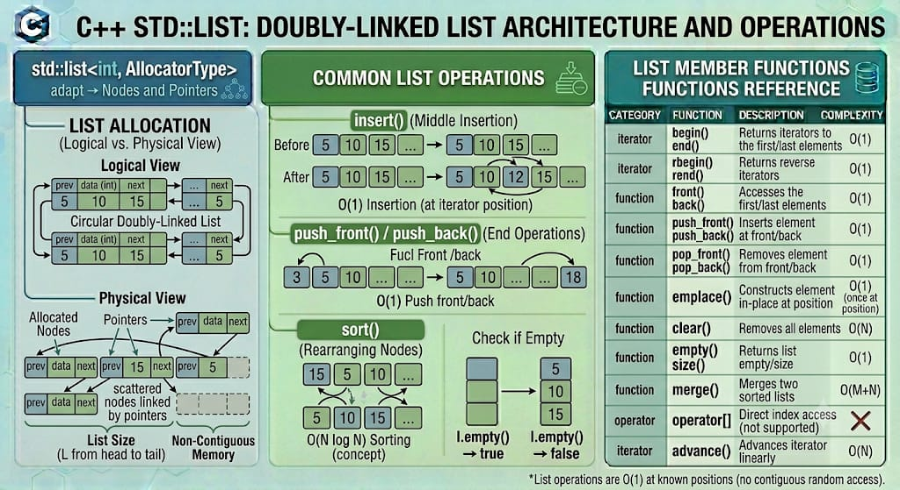

# LIST

`std::list` is a sequence container from the C++ Standard Library that encapsulates a doubly-linked list. It provides constant-time insertion and extraction of elements from anywhere within the container, provided you have an iterator pointing to the location. Unlike `std::vector` or `std::deque`, it does not store elements contiguously in memory and completely lacks support for fast random access.

**Header:** `<list>`

**Template:** `template< class T, class Allocator = std::allocator<T> > class list;`



## High-level characteristics

- **Doubly-linked structure**: Each element is stored in an independent memory node containing the data payload alongside two structural pointers: one pointing to the next node and one pointing to the previous node.
- **Constant-time modifications**: Inserting, moving, or extracting nodes anywhere in the sequence takes strictly $O(1)$ time, assuming you already possess an iterator to the target position.
- **Bidirectional iteration**: Unlike `std::forward_list`, `std::list` allows seamless traversal in both forward (`++it`) and backward (`--it`) directions.
- **No random access**: You cannot jump directly to a specific index using `operator[]` or `.at()`. Reaching the $N$-th element requires sequentially stepping through the list from the beginning or end ($O(N)$ time).
- **High memory overhead**: Every single element requires a distinct dynamic memory allocation and carries the overhead of two extra tracking pointers (`sizeof(void*) * 2`), making it highly cache-unfriendly compared to contiguous arrays.

## How it works internally

Internally, `std::list` manages a sequence of disjointly allocated memory chunks (nodes):
- **Node Architecture**: A typical node structure looks like `struct Node { T data; Node* next; Node* prev; };`.
- **Sentinel / Head Node**: The container object usually maintains a dummy sentinel node or direct head/tail pointers that connect the ends of the sequence, enabling fast $O(1)$ operations at both boundaries.

Because the memory is completely scattered across the heap, algorithms like `std::sort` (which rely on random access iterators and pointer math) cannot be used. To compensate, `std::list` provides its own specialized member functions (`list::sort`, `list::merge`) that manipulate internal node pointers directly without moving the actual data payloads in memory.

**Exception safety**:
- `std::list` provides extremely strong exception guarantees. Because insertions only require allocating a single new node and wiring a few pointers, operations like `push_back` or `insert` never require reallocating or copying existing elements.

## Complexity guarantees

| Operation | Complexity |
|-----------|-----------|
| Access front / back elements | O(1) |
| Arbitrary random access | O(N) (linear time traversal required) |
| `push_front` / `push_back` | O(1) |
| `insert` / `erase` at arbitrary position | O(1) (once the iterator position is reached) |
| Splicing elements from another list | O(1) |
| `size`, `empty` | O(1) (since C++11, size is tracked in constant time) |
| `clear` | O(N) (sequentially calls destructors and deallocates every node) |

## Member functions and operators

### Constructors

```cpp
list();                                             // (1) empty list
explicit list( size_type count );                   // (2) count default-constructed elements
list( size_type count, const T& value );            // (3) count copies of value
template< class InputIt >
list( InputIt first, InputIt last );                // (4) range [first, last)
list( const list& other );                          // (5) copy constructor
list( list&& other ) noexcept;                      // (6) move constructor
list( std::initializer_list<T> init );              // (7) initializer list
```


**Examples:**
```cpp
std::forward_list<int> fl1;                          // empty
std::forward_list<int> fl2(4, 100);                  // {100, 100, 100, 100}
std::forward_list<int> fl3 = {1, 2, 3};              // initializer list
std::forward_list<int> fl4(fl3.begin(), fl3.end());  // range copy
```

### Destructor

```cpp
~list(); // Iterates through all nodes, invoking destructors and freeing heap allocations
```

### Assignment operators

```cpp
list& operator=( const list& other );               // copy assignment
list& operator=( list&& other ) noexcept;           // move assignment
list& operator=( std::initializer_list<T> ilist );  // initializer list assignment
```


### Element access

```cpp
T& front();                                         // reference to the first element (undefined if empty)
const T& front() const;

T& back();                                          // reference to the last element (undefined if empty)
const T& back() const;
```
*Note: `std::list` explicitly lacks `operator[]` and `.at()`.*


### Iterators

```cpp
iterator begin() noexcept;                          // iterator to beginning
const_iterator begin() const noexcept;

iterator end() noexcept;                            // iterator to end (one-past-last)
const_iterator end() const noexcept;

reverse_iterator rbegin() noexcept;                 // reverse iterator to end
const_reverse_iterator rbegin() const noexcept;

reverse_iterator rend() noexcept;                   // reverse iterator to beginning
const_reverse_iterator rend() const noexcept;
```

**Examples:**
```cpp
std::list<int> l = {10, 20, 30};

// Forward iteration
for(auto it = l.begin(); it != l.end(); ++it) {
    std::cout << *it << ' ';                        // 10 20 30
}

// Backward iteration (supported because list is doubly-linked)
for(auto it = l.rbegin(); it != l.rend(); ++it) {
    std::cout << *it << ' ';                        // 30 20 10
}
```

### Capacity

```cpp
bool empty() const noexcept;                        // checks if size == 0
size_type size() const noexcept;                    // number of elements (O(1) since C++11)
size_type max_size() const noexcept;                // maximum theoretical size
```


### Modifiers

#### clear() — Remove all elements

```cpp
void clear() noexcept; // Iterates and deallocates every node
```

#### push / pop — Add/remove at boundaries

```cpp
void push_back( const T& value );                   // copy element to end
void push_back( T&& value );                        // move element to end
void pop_back();                                    // remove last element (undefined if empty)

void push_front( const T& value );                  // copy element to front
void push_front( T&& value );                       // move element to front
void pop_front();                                   // remove first element (undefined if empty)
```


#### insert() — Insert elements

```cpp
iterator insert( const_iterator pos, const T& value );                  // single element copy
iterator insert( const_iterator pos, T&& value );                       // single element move
iterator insert( const_iterator pos, size_type count, const T& value ); // fill
template< class InputIt >
iterator insert( const_iterator pos, InputIt first, InputIt last );     // range
iterator insert( const_iterator pos, std::initializer_list<T> ilist );  // initializer list
```


**Examples:**
```cpp
std::list<int> l = {1, 3};
auto it = l.begin();
std::advance(it, 1);                                // Points to 3 (O(N) traversal)

l.insert(it, 2);                                    // Inserts 2 before 3 -> {1, 2, 3}
```

#### emplace() — Construct and insert in-place

```cpp
template< class... Args >
iterator emplace( const_iterator pos, Args&&... args ); // construct element internally at pos
```

#### erase() — Remove elements

```cpp
iterator erase( const_iterator pos );                             // erase single element at pos
iterator erase( const_iterator first, const_iterator last );       // erase range [first, last)
```


#### swap() — Exchange contents

```cpp
void swap( list& other ) noexcept;                  // Swaps internal head/tail pointers instantly
```

### Specialized List Operations

Because `std::list` cannot use many algorithms from `<algorithm>`, it implements them as internal member functions that manipulate node links directly without copying data:

```cpp
// Transfers elements from one list to another without memory reallocation (O(1))
void splice( const_iterator pos, list& other );
void splice( const_iterator pos, list& other, const_iterator it );
void splice( const_iterator pos, list& other, const_iterator first, const_iterator last );

// Removes specific elements
void remove( const T& value );                      // removes all elements matching value
template< class Predicate >
void remove_if( Predicate p );                      // removes all elements matching predicate

// Reorders elements
void reverse() noexcept;                            // reverses the list order in-place
void unique();                                      // removes consecutive duplicates
void sort();                                        // sorts elements using an O(N log N) merge sort
void merge( list& other );                          // merges two sorted lists into one
```


## Iterator and reference invalidation rules

`std::list` provides the strongest iterator stability of any standard container:

| Operation | Invalidation |
|-----------|---|
| `push_front`/ `push_front` | None. All iterators and references remain valid. |
| `insert` / `emplace` | None. |
| `splice` | None. Iterators to spliced elements remain valid and simply point into the new list. |
| `pop_back` / `pop_front` | Only the erased element is invalidated. |
| `erase` | Only the erased elements are invalidated. |
| `remove` / `remove_if` | Only the removed elements are invalidated. |
| `sort` / `reverse` / `merge` | None. Nodes change sequence, but pointers/iterators to the payload stay valid. |


**Key takeaway:** Unless you explicitly delete or erase a specific node, any reference, pointer, or iterator pointing to a `std::list` payload is absolutely guaranteed to remain valid and stable in memory, regardless of how much the list changes around it.

## Typical pitfalls and best practices

1. **Avoid default usage over `std::vector`**: Bjarne Stroustrup (creator of C++) famously advises defaulting to `std::vector` for almost all use cases. Because of modern CPU caching architectures, `vector` insertions are often faster than `list` insertions even in the middle of a sequence, due to the massive overhead of fragmented heap traversal.

2. **`std::distance` and `std::advance` overhead**: Be acutely aware that calculating distances or advancing iterators mathematically requires iterating node-by-node. `std::advance(it, 100)` takes 100 operations, not 1.

3. **Use member `.sort()`**: Never attempt to run `std::sort(l.begin(), l.end())`. It will throw a compilation error. Always use the member function `l.sort()`.

4. **Leverage `.splice()`**: If you aren't using `splice()`, you probably shouldn't be using `std::list`. Splicing allows you to move massive sub-lists from one list to another in $O(1)$ time by merely reassigning pointers. 


## Common idioms and patterns

### Fast O(1) Splicing

Moving elements between lists without copying data is the primary superpower of `std::list`:

```cpp
std::list<int> list1 = {1, 2, 3, 4, 5};
std::list<int> list2 = {10, 20, 30};

auto it = list1.begin();
std::advance(it, 2);                                // Points to 3

// Instantly move ALL of list2 into list1 before the number 3
list1.splice(it, list2);                            // list1 = {1, 2, 10, 20, 30, 3, 4, 5}
                                                    // list2 is now empty
```

### Stable Reference Tracking

```cpp
std::list<Player> active_players;
active_players.push_back({"Alice", 100});

// Store an iterator pointing directly to Alice
auto target_player = active_players.begin();

// Massive insertions and deletions occur around her
active_players.push_front({"Bob", 50});
active_players.push_back({"Charlie", 200});

// The target_player iterator remains completely valid and stable
target_player->score += 50;
```


## Real-world use cases

- **LRU (Least Recently Used) Caches**: Combining a `std::list` (to track the chronological usage order via fast front/back node moving) with a `std::unordered_map` (to map keys directly to the list iterators for $O(1)$ lookups).

- **Operating system scheduler queues**: Rapidly transferring process control blocks between "waiting", "ready", and "running" queues using $O(1)$ `splice()` operations without memory reallocation.
  
- **Lock-free concurrent data structures**: Specialized linked lists are easier to make thread-safe via atomic pointer swapping compared to reallocating massive contiguous arrays.

- **Managing heavy or non-movable objects**: If an object takes massive computational overhead to copy or move, placing it in a node-based list ensures its memory address will never shift throughout its lifecycle.


## Useful headers and related features

| Header | Functionality |
|--------|---|
| `<list>` | Doubly-linked list container counterpart |
| `<forward_list>` | Singly-linked list container (lower memory footprint) |


## Full example program

```cpp
#include <iostream>
#include <list>
#include <string>

int main() {
    // 1. Initialization
    std::list<std::string> itinerary = {"London", "Paris", "Berlin"};

    std::cout << "Original List: ";
    for (const auto& city : itinerary) std::cout << city << " -> ";
    std::cout << "END\n";

    // 2. Modifying via iterators
    auto it = itinerary.begin();
    std::advance(it, 1);                            // Points to "Paris"
    
    // Insert "Amsterdam" before "Paris"
    itinerary.insert(it, "Amsterdam");

    // 3. Modifying boundaries
    itinerary.push_front("New York");               // Start point
    itinerary.push_back("Rome");                    // End point

    std::cout << "Modified List: ";
    for (const auto& city : itinerary) std::cout << city << " -> ";
    std::cout << "END\n\n";

    // 4. Internal sorting algorithm
    itinerary.sort();                               // Alphabetical sort via internal pointer swapping

    std::cout << "Alphabetically Sorted: ";
    for (const auto& city : itinerary) std::cout << city << " -> ";
    std::cout << "END\n\n";

    // 5. Using splice to merge lists in O(1) time
    std::list<std::string> secondary_trip = {"Tokyo", "Seoul"};
    
    // Move all elements from secondary_trip to the beginning of itinerary
    itinerary.splice(itinerary.begin(), secondary_trip);

    std::cout << "After Splicing secondary trip to front:\n";
    for (const auto& city : itinerary) std::cout << city << " -> ";
    std::cout << "END\n";
    std::cout << "Secondary trip size is now: " << secondary_trip.size() << '\n';

    return 0;
}
```

**Output:**
```
Original List: London -> Paris -> Berlin -> END
Modified List: New York -> London -> Amsterdam -> Paris -> Berlin -> Rome -> END

Alphabetically Sorted: Amsterdam -> Berlin -> London -> New York -> Paris -> Rome -> END

After Splicing secondary trip to front:
Tokyo -> Seoul -> Amsterdam -> Berlin -> London -> New York -> Paris -> Rome -> END
Secondary trip size is now: 0
```

---


