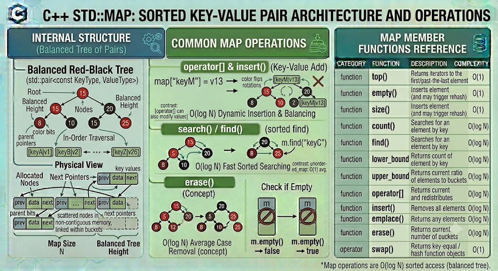

# MAP

`std::map` is a sorted associative container from the C++ Standard Library that contains key-value pairs with unique keys. Keys are sorted automatically using a specified comparison function (by default, `std::less<Key>`). Search, removal, and insertion operations have logarithmic time complexity. Because the container is strictly ordered by its keys, the key portion of an element is treated as `const` and cannot be modified directly once inserted.

**Header:** `<map>`

**Template:** 
```cpp
template<
    class Key,
    class T,
    class Compare = std::less<Key>,
    class Allocator = std::allocator<std::pair<const Key, T>>
> class map;
```



## High-level characteristics

- **Key-Value association**: Every element stored in a `std::map` is specifically a `std::pair<const Key, T>`.
- **Sorted elements**: Elements are always maintained in a strictly ordered sequence according to the `Compare` function applied to the keys.
- **Uniqueness strictly enforced**: A `std::map` cannot contain duplicate keys. If you try to insert a key that already exists, the insertion is ignored (though the mapped value T can be updated using specific methods). For duplicate keys, use `std::multimap`.
- **Immutable keys**: While you can freely modify the mapped value (`T`), the key (`Key`) is locked as `const`. Modifying a key would break the internal sorting of the tree.
- **Bidirectional iteration**: You can iterate through the map forwards or backwards, and the elements will always be yielded in sorted key order.


## How it works internally

Internally, `std::map` is almost universally implemented as a Red-Black Tree (a self-balancing binary search tree).

- **Node-based allocation**: Every key-value pair is wrapped inside its own dynamically allocated node, containing the payload (`std::pair`), a balancing color flag, and pointers to its parent, left child, and right child.
- **Self-Balancing math**: When elements are inserted or removed, the tree automatically rotates and recolors nodes to guarantee that the longest path from the root to any leaf is no more than twice the length of the shortest path. This guarantees $O(\log n)$ performance.

Because data is scattered across the heap in nodes, `std::map` does not support $O(1)$ random access or pointer arithmetic.

**Exception safety**:
- `std::map` provides strong exception guarantees. If a single-element insertion throws an exception (e.g., `std::bad_alloc`), the map's state is completely restored to what it was before the operation began.

## Complexity guarantees

| Operation | Complexity |
|-----------|-----------|
| Lookup (`at, operator[], find, count`) | O(log N) |
| Insertion (`insert, emplace, operator[]`) | O(log N) |
| Erasure by key | O(log N) |
| Erasure by iterator | Amortized O(1) |
| `size`, `empty` | O(1) |
| `clear` | O(N) (sequentially calls destructors and deallocates every node) |

## Member functions and operators

### Constructors

```cpp
map();                                              // (1) empty map
explicit map( const Compare& comp );                // (2) empty map with custom comparator
template< class InputIt >
map( InputIt first, InputIt last );                 // (3) range [first, last)
map( const map& other );                            // (4) copy constructor
map( map&& other ) noexcept;                        // (5) move constructor
map( std::initializer_list<value_type> init );      // (6) initializer list
```


**Examples:**
```cpp
std::map<std::string, int> m1;                      // empty
std::map<std::string, int> m2 = {                   // initializer list
    {"Alice", 25}, 
    {"Bob", 30}
};
std::map<int, std::string, std::greater<int>> m3;   // map sorted in descending key order
```

### Destructor

```cpp
~map(); // Destroys all nodes and frees heap allocations
```


### Element access

```cpp
T& at( const Key& key );                            // bounds-checked access, throws std::out_of_range if not found
const T& at( const Key& key ) const;

T& operator[]( const Key& key );                    // returns reference to value. INSERTS default-constructed value if key doesn't exist
T& operator[]( Key&& key );
```

**Examples**

```cpp
std::map<std::string, int> ages = {{"Alice", 25}};

int a = ages.at("Alice");                           // a = 25
// int b = ages.at("Bob");                          // Throws std::out_of_range!

int c = ages["Charlie"];                            // "Charlie" is not found. It is INSERTED with value 0. c = 0.
ages["Alice"] = 26;                                 // Updates "Alice" to 26
```

### Iterators

```cpp
iterator begin() noexcept;                          // iterator to the smallest key
iterator end() noexcept;                            // iterator to end (one-past-largest)
reverse_iterator rbegin() noexcept;                 // reverse iterator (points to largest key)
reverse_iterator rend() noexcept;
```

**Examples:**
```cpp
std::map<int, std::string> m = {{2, "Two"}, {1, "One"}};

// Iterates in sorted key order: 1 then 2
for(auto it = m.begin(); it != m.end(); ++it) {
    std::cout << it->first << ": " << it->second << '\n';
}
```

### Capacity

```cpp
bool empty() const noexcept;                        // checks if size == 0
size_type size() const noexcept;                    // number of key-value pairs
```


### Modifiers

#### insert() / emplace() — Insert elements

```cpp
std::pair<iterator, bool> insert( const value_type& value );  
template< class... Args >
std::pair<iterator, bool> emplace( Args&&... args );

// C++17 advanced insertions:
template <class... Args>
std::pair<iterator, bool> try_emplace(const Key& k, Args&&... args); // Does not construct the value if key exists
template <class M>
std::pair<iterator, bool> insert_or_assign(const Key& k, M&& obj);   // Inserts if missing, updates if exists
```


**Examples:**
```cpp
std::map<int, std::string> m;
auto [it, success] = m.insert({1, "A"});            // success = true
auto [it2, success2] = m.insert({1, "B"});          // success2 = false. Key 1 already exists. Value remains "A".

m.insert_or_assign(1, "B");                         // Key 1 now holds "B"
```

#### erase() — Remove elements

```cpp
iterator erase( const_iterator pos );                 // erase element at iterator (Amortized O(1))
iterator erase( const_iterator first, const_iterator last ); // erase range
size_type erase( const Key& key );                    // erase by key (O(log N)), returns 1 if erased, 0 if not
```


#### extract() and merge() (C++17) 

```cpp
node_type extract( const key_type& x );               // unlinks a node from the tree without destroying it
void merge( map& source );                            // moves nodes from another map into this one without reallocation
```

#### Lookup

```cpp
size_type count( const Key& key ) const;              // returns 1 if found, 0 if not
iterator find( const Key& key );                      // returns iterator to element, or end() if not found
bool contains( const Key& key ) const;                // (C++20) returns true if key exists

iterator lower_bound( const Key& key );               // iterator to first element with key >= target
iterator upper_bound( const Key& key );               // iterator to first element with key > target
```


## Iterator and reference invalidation rules

Because `std::map` allocates nodes dynamically and links them via pointers, its invalidation properties are highly stable:

| Operation | Invalidation |
|-----------|---|
| `insert` / `emplace` / `operator[]` | None. Existing pointers, references, and iterators remain perfectly valid. |
| `extract` | Only iterators to the extracted node are invalidated. References and pointers remain valid. |
| `merge` | Iterators to merged nodes are invalidated. Pointers and references remain valid. |
| `erase` | Only the erased elements are invalidated. |
| `clear` / Destruction | All pointers, references, and iterators are invalidated. |    


**Key takeaway:** Modifying a `std::map` never causes other existing elements to shift in memory.

## Typical pitfalls and best practices

1. **The `operator[]` trap**: `map[key]` does not just look up a value; it creates it if it doesn't exist. If you only want to check if a key exists or read its value without mutating the map, use `.find()`, `.contains()`, or `.at()`.

2. **`try_emplace` vs `emplace` (C++17)**: If the value you are constructing is expensive (e.g., a large string or complex object), standard `insert` or `emplace` will construct the object before checking if the key exists, potentially wasting resources. `try_emplace` checks the key first and only constructs the value if the key is missing.

3. **Use `std::unordered_map` if order doesn't matter: The $O(\log N)$ tree traversal of `std::map` can be slow for massive datasets. If you just need a key-value dictionary and don't care about alphabetical/numerical sorting, `std::unordered_map` (Hash Table) provides much faster $O(1)$ lookups.

4. **Const Keys**: Remember that an iterator's `->first` is const. You cannot do `it->first = new_key;`. You must extract/erase the node and insert a new one.


## Common idioms and patterns

### Iterating with C++17 Structured Bindings

The cleanest way to iterate over a map is using structured bindings to unpack the `std::pair` directly:

```cpp
std::map<std::string, int> inventory = {{"Apples", 10}, {"Bananas", 5}};

for (const auto& [item, quantity] : inventory) {
    std::cout << item << ": " << quantity << '\n';
}
```

### Frequency Counting / Histogram

Because operator[] default-constructs integers to 0, building a frequency map is incredibly concise:

```cpp
std::vector<std::string> words = {"apple", "banana", "apple", "orange", "banana", "apple"};
std::map<std::string, int> frequency;

for (const auto& word : words) {
    frequency[word]++; // If word doesn't exist, it is created as 0, then incremented to 1
}
```

### Modifying a key without reallocation (C++17)


```cpp
std::map<int, std::string> m = {{1, "One"}, {2, "Two"}};

auto node = m.extract(1);       // Unlinks key '1' from tree
if (!node.empty()) {
    node.key() = 10;            // Change the key! (Only possible on extracted nodes)
    m.insert(std::move(node));  // Re-insert. Memory was never deallocated.
}
// Map is now {{2, "Two"}, {10, "One"}}
```

## Real-world use cases

- **Dictionaries and Caches**: Associating lookup keys (like a User ID or String) with complex payload data (like a User Object or Configuration struct).

- **Histograms and Frequency Counters**: Tracking how many times an event or word occurs in a dataset.
  
- **Routing Tables**: Mapping IP address prefixes to specific network interfaces, where sorted order helps with prefix matching.

- **Sparse Matrices / Arrays**: If you have a massive array where 99% of the values are 0, instead of allocating the whole array, you can use `std::map<int, double>` to only store the indices that have non-zero values.


## Useful headers and related features

| Header | Functionality |
|--------|---|
| `<map>` | Provides `std::map` and `std::multimap` |
| `<unordered_map>` | Hash-table based equivalent (faster O(1) lookups, no ordering) |
| `<utility>` | Contains `std::pair`, which map uses internally |


## Full example program

```cpp
#include <iostream>
#include <map>
#include <string>

int main() {
    // 1. Initialization
    std::map<std::string, std::string> phone_book = {
        {"Alice", "555-0100"},
        {"Charlie", "555-0102"},
        {"Bob", "555-0101"}
    };

    // 2. Safe Lookup (C++20 .contains)
    std::string target = "Bob";
    if (phone_book.contains(target)) {
        std::cout << target << "'s number is: " << phone_book.at(target) << "\n\n";
    }

    // 3. The operator[] behavior
    // "David" does not exist. operator[] creates him with an empty string, then assigns the new number.
    phone_book["David"] = "555-0103"; 

    // 4. Safe Insertion without overwriting
    // Alice already exists, so "555-9999" will NOT overwrite her current number
    auto [it, success] = phone_book.insert({"Alice", "555-9999"});
    if (!success) {
        std::cout << "Failed to insert Alice. She already has the number: " << it->second << "\n\n";
    }

    // 5. C++17 insert_or_assign (Explicitly overwrite)
    phone_book.insert_or_assign("Alice", "555-9999"); // Alice is now updated

    // 6. Iteration (Guaranteed to be alphabetical by key)
    std::cout << "--- Official Phone Book ---\n";
    for (const auto& [name, number] : phone_book) {
        std::cout << name << ": " << number << '\n';
    }

    return 0;
}
```

**Output:**
```
Bob's number is: 555-0101

Failed to insert Alice. She already has the number: 555-0100

--- Official Phone Book ---
Alice: 555-9999
Bob: 555-0101
Charlie: 555-0102
David: 555-0103
```

---


