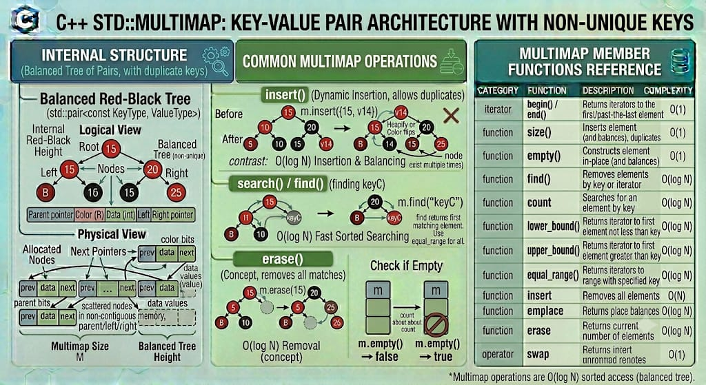

# MULTIMAP

`std::multimap` is a sorted associative container from the C++ Standard Library that contains key-value pairs. Unlike `std::map`, **it allows multiple elements to have the exact same key**. The elements are sorted automatically by their keys using a specified comparison function (by default, `std::less<Key>`). Search, removal, and insertion operations have logarithmic time complexity. 

**Header:** `<map>`

**Template:** 
```cpp
template<
    class Key,
    class T,
    class Compare = std::less<Key>,
    class Allocator = std::allocator<std::pair<const Key, T>>
> class multimap;
```



## High-level characteristics

- **Duplicate Keys Allowed**: You can insert multiple identical keys, each mapping to the same or different values.
- **Key-Value association**: Every element stored is a `std::pair<const Key, T>`.
- **Sorted elements**: Elements are always maintained in a strictly ordered sequence according to the Compare function applied to the keys. Elements with equivalent keys are grouped together in memory.
- **Immutable keys**: The key (Key) is locked as const. Modifying a key directly would break the internal sorting of the tree.
- **Bidirectional iteration**: You can iterate through the multimap forwards or backwards, and the elements will always be yielded in sorted key order.

## How it works internally

Internally, `std::multimap` is implemented identically to `std::map`—as a Red-Black Tree (a self-balancing binary search tree).

- **Node-based allocation**: Every key-value pair is wrapped inside its own dynamically allocated node.
- **Self-Balancing math**: When elements are inserted or removed, the tree automatically rotates and recolors nodes to guarantee $O(\log n)$ traversal depth.
- **Duplicate Placement**: The standard guarantees that elements with equivalent keys are inserted in a way that keeps them adjacent to each other during iteration. In C++11 and later, the relative order of elements with equivalent keys is strictly preserved (the one inserted first will be iterated first).

Because data is scattered across the heap in nodes, `std::multimap` does not support $O(1)$ random access or pointer arithmetic.

**Exception safety**:

- Provides strong exception guarantees for single-element insertions. If memory allocation fails, the tree remains perfectly intact.


## Complexity guarantees

| Operation | Complexity |
|-----------|-----------|
| Lookup (`find, count, equal_range, contains`) | O(log N) + O(K) where K is the number of matching elements | 
| Insertion (`insert, emplace`) | O(log N) | 
| Erasure by key | O(log N) + O(K) where K is the number of erased elements | 
| Erasure by iterator | Amortized O(1) | 
| `size`, `empty` | O(1) | 
| `clear` | O(N) | 


## Member functions and operators

### Constructors

```cpp
multimap();                                         // (1) empty multimap
explicit multimap( const Compare& comp );           // (2) empty multimap with custom comparator
template< class InputIt >
multimap( InputIt first, InputIt last );            // (3) range [first, last)
multimap( const multimap& other );                  // (4) copy constructor
multimap( multimap&& other ) noexcept;              // (5) move constructor
multimap( std::initializer_list<value_type> init ); // (6) initializer list
```


**Examples:**
```cpp
std::multimap<std::string, int> mm1;                // empty
std::multimap<std::string, int> mm2 = {             // initializer list
    {"Alice", 25}, 
    {"Alice", 30}, 
    {"Bob", 40}
}; // "Alice" legally maps to two different values!
```

### Destructor

```cpp
~multimap(); // Destroys all nodes and frees heap allocations
```


### Element access

**CRITICAL DIFFERENCE**: Just like `std::unordered_multimap`, `std::multimap` does NOT provide `operator[] or .at()`. Because a single key can map to multiple values, `mm["Alice"]` would not know whether to return 25 or 30. You must access values using iterators via `find()` or `equal_range()`.


### Iterators

```cpp
iterator begin() noexcept;                          // iterator to the smallest key
iterator end() noexcept;                            // iterator to end (one-past-largest)
reverse_iterator rbegin() noexcept;                 // reverse iterator (points to largest key)
reverse_iterator rend() noexcept;
```


### Capacity 

```cpp
bool empty() const noexcept;                        // checks if size == 0
size_type size() const noexcept;                    // total number of key-value pairs
```

### Modifiers

#### insert() / emplace() — Insert elements

```cpp
iterator insert( const value_type& value );                   // ALWAYS succeeds. Returns iterator to new element.
template< class... Args >
iterator emplace( Args&&... args );
```


#### erase() — Remove elements

```cpp
iterator erase( const_iterator pos );                 // erase element at iterator (Amortized O(1))
iterator erase( const_iterator first, const_iterator last ); // erase range
size_type erase( const Key& key );                    // erase ALL pairs matching 'key' (Returns count)
```


#### extract() and merge() (C++17) 

```cpp
node_type extract( const key_type& x );               // unlinks a single node matching x from the tree
void merge( multimap& source );                       // moves nodes from another multimap into this one
```

#### Lookup

Because duplicates exist, lookup functions often focus on finding ranges or counts.

```cpp
size_type count( const Key& key ) const;              // returns the number of times 'key' appears
iterator find( const Key& key );                      // returns an iterator to the FIRST element matching 'key'
bool contains( const Key& key ) const;                // (C++20) returns true if at least one 'key' exists

iterator lower_bound( const Key& key );               // iterator to first element with key >= target
iterator upper_bound( const Key& key );               // iterator to first element with key > target
std::pair<iterator,iterator> equal_range( const Key& key ); // Returns a range containing ALL elements matching 'key'
```


## Iterator and reference invalidation rules

Because `std::multimap` allocates nodes dynamically and links them via pointers, its invalidation properties are highly stable:

| Operation | Invalidation | 
|-----------|---|
| `insert / emplace` | None. Existing pointers, references, and iterators remain perfectly valid. |
| `merge` | Iterators to merged nodes are invalidated. Pointers and references remain valid. |
| `erase` | Only the erased elements are invalidated. |
| `extract` | Only iterators to the extracted node are invalidated. References and pointers remain valid. |
| `clear` / Destruction | All pointers, references, and iterators are invalidated. |

### Key takeaway
Modifying a `std::multimap` never causes other existing elements to shift in memory.


## Typical pitfalls and best practices

1. **The `erase(key)` trap**: Calling `mm.erase("Alice")` will remove every single value mapped to "Alice". If you only want to remove one specific key-value pair for Alice, you must find an iterator first and erase that specific iterator: `mm.erase(mm.find("Alice"))`;.

2. **`multimap<K, V>` vs `map<K, vector<V>>:`**:
  - If you frequently need to look up a key and iterate over all its associated values, `std::map<K, std::vector<V>>` is usually much faster and more cache-friendly than `std::multimap`.
  - `std::multimap` shines when you are constantly inserting/erasing individual pairs on the fly and don't want the overhead of dynamically resizing arrays inside a standard map.

3. **`No operator[]`**: Do not try to use `mm[key] = value`. Use `mm.insert({key, value})`.


## Common idioms and patterns

### Processing all values for a single key

Because a key can map to many values, `equal_range` is the primary way to interact with an `multimap`:

```cpp
std::multimap<std::string, std::string> dictionary = {
    {"Run", "To move at a speed faster than a walk"},
    {"Run", "A continuous spell of a particular situation"}
};

// Get the boundaries for all definitions mapped to "Run"
auto [range_start, range_end] = dictionary.equal_range("Run");

for (auto it = range_start; it != range_end; ++it) {
    std::cout << "Definition: " << it->second << '\n';
}
```

## Real-world use cases

- **Dictionaries and Thesauruses**: A single word (Key) mapped to multiple different definitions or synonyms (Values), kept in alphabetical order for display.

- **Flight Scheduling Systems**: Mapping a departure time (Key) to multiple different flight identifiers (Values). The data naturally stays sorted chronologically, allowing quick range-queries (e.g., "All flights between 8:00 AM and 10:00 AM" using `lower_bound` and `upper_bound`).

- **High-Score Leaderboards**: Mapping a numeric score (Key) to a player's name (Value). Multiple players can achieve the exact same score, and the container automatically keeps the entire leaderboard sorted.


## Useful headers and related features

| Header | Functionality |
|--------|---|
| `<map>` | Provides `std::map` and `std::multimap` |
| `<unordered_map>` | Hash-table based equivalent (`std::unordered_multimap`) for faster $O(1)$ lookups when sorting isn't needed. |
| `<utility>` | Contains `std::pair`, which multimap uses internally |


## Full example program

```cpp
#include <iostream>
#include <map>
#include <string>

int main() {
    // 1. Initialization (Duplicates allowed, auto-sorted by Key)
    std::multimap<int, std::string> leaderboards = {
        {150, "Alice"},
        {200, "Bob"},
        {150, "Charlie"},
        {300, "David"}
    };

    // 2. Safe Insertion (No overwriting, just inserting new nodes)
    leaderboards.insert({200, "Eve"});

    // 3. Iteration (Guaranteed to be sorted by Key)
    std::cout << "--- Global Leaderboard ---\n";
    // Notice that Alice and Charlie (150) are next to each other, as are Bob and Eve (200).
    for (const auto& [score, player] : leaderboards) {
        std::cout << "Score: " << score << " | Player: " << player << '\n';
    }
    std::cout << '\n';

    // 4. Checking quantities
    int target_score = 200;
    std::cout << "Number of players with score " << target_score << ": " 
              << leaderboards.count(target_score) << "\n\n";

    // 5. Using equal_range to get all values for a specific key
    std::cout << "--- Players tied at 200 points ---\n";
    auto [start_it, end_it] = leaderboards.equal_range(200);
    for (auto it = start_it; it != end_it; ++it) {
        std::cout << "- " << it->second << '\n';
    }
    std::cout << '\n';

    // 6. Removing EXACTLY ONE key-value pair
    std::cout << "Disqualifying Charlie... removing his score.\n";
    // We cannot just use .erase(150), as that deletes Alice too!
    auto charlie_it = leaderboards.find(150); // Finds the first 150
    // To be safe in production, you should loop through equal_range(150) 
    // to find the exact pair where it->second == "Charlie".
    if (charlie_it != leaderboards.end() && charlie_it->second == "Charlie") {
        leaderboards.erase(charlie_it); 
    }

    // 7. Removing ALL values for a key
    std::cout << "Wiping all scores of 200 due to a glitch.\n";
    leaderboards.erase(200); // Deletes EVERY pair where the key is 200

    // 8. Processing remaining items
    std::cout << "\n--- Final Leaderboard ---\n";
    for (const auto& [score, player] : leaderboards) {
        std::cout << "Score: " << score << " | Player: " << player << '\n';
    }

    return 0;
}
```

**Output:**
```
--- Global Leaderboard ---
Score: 150 | Player: Alice
Score: 150 | Player: Charlie
Score: 200 | Player: Bob
Score: 200 | Player: Eve
Score: 300 | Player: David

Number of players with score 200: 2

--- Players tied at 200 points ---
- Bob
- Eve

Disqualifying Charlie... removing his score.
Wiping all scores of 200 due to a glitch.

--- Final Leaderboard ---
Score: 150 | Player: Alice
Score: 300 | Player: David
```

---


