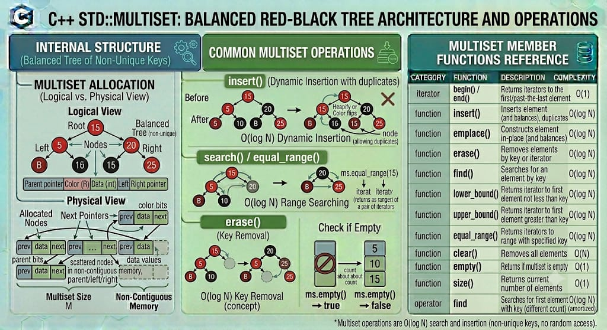

# MULTISET

`std::multiset` is a sorted associative container from the C++ Standard Library that contains a collection of objects of type `Key`. Unlike `std::set`, **it allows multiple elements to have the exact same value (duplicates)**. The elements are sorted automatically according to a specified comparison function (by default, `std::less<Key>`). Search, removal, and insertion operations have logarithmic time complexity.

**Header:** `<set>`

**Template:** 
```cpp
template<
    class Key,
    class Compare = std::less<Key>,
    class Allocator = std::allocator<Key>
> class multiset;
```



## High-level characteristics

- **Duplicates Allowed**: You can insert the exact same value multiple times. All identical values will be grouped together and sorted adjacent to one another.
- **Sorted elements**: Elements are always maintained in a strictly ordered sequence according to the Compare function.
- **Sorted elements**: Elements are always maintained in a strictly ordered sequence according to the Compare function applied to the keys. Elements with equivalent keys are grouped together in memory.
- **Immutable keys**: The values inside the multiset act as their own keys and are locked as `const`. Modifying an element directly is forbidden because it would break the internal sorting of the tree.
- **Bidirectional iteration**: You can iterate through the multiset forwards or backwards, and the elements will always be yielded in sorted order.


## How it works internally

Internally, std::multiset is almost universally implemented as a Red-Black Tree (a self-balancing binary search tree).

- **Node-based allocation**: Every element is wrapped inside its own dynamically allocated node on the heap.
- **Self-Balancing math**: When elements are inserted or removed, the tree automatically rotates and recolors nodes to guarantee $O(\log n)$ traversal depth.
- **Duplicate Placement**: The standard guarantees that elements with equivalent keys are inserted in a way that keeps them adjacent to each other during iteration. In C++11 and later, the relative order of elements with equivalent keys is strictly preserved (the one inserted first will be iterated first).

Because data is scattered across the heap in nodes, `std::multiset` does not support $O(1)$ random access (`operator[]`).

**Exception safety**:

- Provides strong exception guarantees for single-element insertions. If memory allocation fails, the tree remains perfectly intact and unchanged.


## Complexity guarantees

| Operation | Complexity |
|-----------|-----------|
| Lookup (`find, count, equal_range, contains`) | O(log N) + O(K) where K is the number of matching elements | 
| Insertion (`insert, emplace`) | O(log N) | 
| Erasure by key | O(log N) + O(K) where K is the number of erased elements | 
| Erasure by iterator | Amortized O(1) | 
| `size`, `empty` | O(1) | 
| `clear` | O(N) | 


## Member functions and operators

### Constructors

```cpp
multiset();                                         // (1) empty multiset
explicit multiset( const Compare& comp );           // (2) empty multiset with custom comparator
template< class InputIt >
multimap( InputIt first, InputIt last );            // (3) range [first, last)
multiset( const multiset& other );                  // (4) copy constructor
multiset( multiset&& other ) noexcept;              // (5) move constructor
multiset( std::initializer_list<value_type> init ); // (6) initializer list
```


**Examples:**
```cpp
std::multiset<int> ms1;                             // empty
std::multiset<int> ms2 = {5, 1, 5, 2, 5};           // {1, 2, 5, 5, 5} (sorted, duplicates kept)
std::multiset<int, std::greater<int>> ms3 = {1, 2, 2}; // {2, 2, 1} (custom descending order)
```

### Destructor

```cpp
~multiset(); // Destroys all nodes and frees heap allocations
```


### Element access

Because it only contains keys and does not map to separate values, it does NOT provide `operator[], .at(), .front(), or .back()`. Elements must be accessed via Iterators.


### Iterators

```cpp
iterator begin() noexcept;                          // iterator to the smallest element
iterator end() noexcept;                            // iterator to end (one-past-largest)
reverse_iterator rbegin() noexcept;                 // reverse iterator (points to largest element)
reverse_iterator rend() noexcept;
```


### Capacity 

```cpp
bool empty() const noexcept;                        // checks if size == 0
size_type size() const noexcept;                    // total number of elements (including duplicates)
```

### Modifiers

#### insert() / emplace() — Insert elements

```cpp
iterator insert( const value_type& value );                   // ALWAYS succeeds. Returns iterator to new element.
template< class... Args >
iterator emplace( Args&&... args );
```


#### erase() — Remove elements

```cpp
iterator insert( const value_type& value );                   // ALWAYS succeeds. Returns iterator to new element.
template< class... Args >
iterator emplace( Args&&... args );
```


#### extract() and merge() (C++17) 

```cpp
node_type extract( const key_type& x );               // unlinks a single node matching x from the tree
void merge( multiset& source );                       // moves nodes from another multiset into this one
```

#### Lookup

Because duplicates exist, lookup functions often focus on finding ranges or counts.

```cpp
size_type count( const Key& key ) const;              // returns the number of times 'key' appears
iterator find( const Key& key );                      // returns an iterator to the FIRST element matching 'key'
bool contains( const Key& key ) const;                // (C++20) returns true if at least one 'key' exists

iterator lower_bound( const Key& key );               // iterator to first element >= target
iterator upper_bound( const Key& key );               // iterator to first element > target
std::pair<iterator,iterator> equal_range( const Key& key ); // Returns a range containing ALL elements matching 'key'
```


## Iterator and reference invalidation rules

Because `std::multiset` allocates nodes dynamically and links them via pointers, its invalidation properties are highly stable:

| Operation | Invalidation | 
|-----------|---|
| `insert / emplace` | None. Existing pointers, references, and iterators remain perfectly valid. |
| `merge` | Iterators to merged nodes are invalidated. Pointers and references remain valid. |
| `erase` | Only the erased elements are invalidated. |
| `extract` | Only iterators to the extracted node are invalidated. References and pointers remain valid. |
| `clear` / Destruction | All pointers, references, and iterators are invalidated. |

### Key takeaway
Modifying a `std::multiset` never causes other existing elements to shift in memory.


## Typical pitfalls and best practices

1. **The `erase(value)` trap**: Calling `ms.erase(10)` will remove every single instance of the number 10 from the multiset. If you only want to remove one instance, you must find an iterator first and erase that specific iterator: `ms.erase(ms.find(10))`;.

2. **Frequency Counting vs `std::map`**: While `std::multiset` can count frequencies using `.count()`, it is memory-inefficient to store 10,000 literal identical strings just to know the count is 10,000. It is almost always better to use `std::map<std::string, int>` for frequency counting.

3. **Never use `std::find`**: Do not use the `<algorithm>` version of `std::find(ms.begin(), ms.end(), val)`. It runs in $O(N)$ linear time. Always use the member function `ms.find(val)`, which uses the tree to find the element in $O(\log N)$ time.`.


## Common idioms and patterns

### Using lower_bound and upper_bound for range queries

Because the multiset is sorted, you can quickly grab a subset of elements within a specific range:

```cpp
std::multiset<int> scores = {50, 65, 70, 70, 75, 80, 90};

// Get all scores from 70 up to (but not including) 80
auto start = scores.lower_bound(70); // Points to the first 70
auto end = scores.lower_bound(80);   // Points to 80

for (auto it = start; it != end; ++it) {
    std::cout << *it << " "; // Output: 70 70 75
}
```

## Real-world use cases

- **Event Schedulers / Timelines**: Storing timestamps for upcoming events. The container automatically keeps them sorted chronologically, and multiple events are allowed to trigger at the exact same millisecond.

- **Rolling Medians**: Maintaining a sliding window of values where duplicates are common, allowing you to easily find the median by advancing an iterator to the middle of the sorted collection.

- **Sorted "Bag" Data Structures**: Situations where you need to hold multiple identical items (like an inventory of 5 swords of the same type) but still want them automatically sorted alphabetically or by a specific attribute for UI display.


## Useful headers and related features

| Header | Functionality |
|--------|---|
| `<set>` | Provides `std::set` and `std::multiset` |
| `<unordered_set>` | Hash-table based equivalent (`std::unordered_multiset`) for faster $O(1)$ lookups when sorting isn't needed. |


## Full example program

```cpp
#include <iostream>
#include <set>
#include <string>

int main() {
    // 1. Initialization (Duplicates allowed, auto-sorted)
    std::multiset<int> exam_scores = {85, 92, 78, 92, 100, 85, 92};

    std::cout << "--- All Exam Scores (Sorted) ---\\n";
    for (int score : exam_scores) {
        std::cout << score << " ";
    }
    std::cout << "\\n\\n";

    // 2. Checking quantities
    int target_score = 92;
    std::cout << "Number of students who scored " << target_score << ": " 
              << exam_scores.count(target_score) << "\\n\\n";

    // 3. Using equal_range to iterate over duplicates
    std::cout << "--- Processing scores of 85 ---\\n";
    auto [start_it, end_it] = exam_scores.equal_range(85);
    for (auto it = start_it; it != end_it; ++it) {
        std::cout << "Found an 85! Applying curve...\\n";
    }
    std::cout << '\\n';

    // 4. Removing EXACTLY ONE instance of a value
    std::cout << "One score of 92 was invalid. Removing exactly ONE 92...\\n";
    auto target_it = exam_scores.find(92);
    if (target_it != exam_scores.end()) {
        exam_scores.erase(target_it); // Erases ONLY the first 92 it found
    }

    // 5. Removing ALL instances of a value
    std::cout << "Scores of 78 are being dropped. Erasing all 78s...\\n";
    exam_scores.erase(78); // Erases EVERY 78 in the set

    // 6. Processing remaining items
    std::cout << "\\n--- Final Validated Scores ---\\n";
    for (int score : exam_scores) {
        std::cout << score << " ";
    }
    std::cout << '\\n';

    return 0;
}
```

**Output:**

```
--- All Exam Scores (Sorted) ---
78 85 85 92 92 92 100 

Number of students who scored 92: 3

--- Processing scores of 85 ---
Found an 85! Applying curve...
Found an 85! Applying curve...

One score of 92 was invalid. Removing exactly ONE 92...
Scores of 78 are being dropped. Erasing all 78s...

--- Final Validated Scores ---
85 85 92 92 100
```

---


