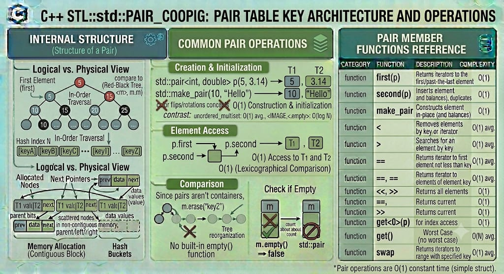

## PAIR

`std::pair` is a structural utility class template from the C++ Standard Library that provides a way to store two heterogeneous objects as a single unit. While it is not a sequence or associative container itself, it is the foundational building block for maps (`std::map`, `std::unordered_map`) and is widely used across the STL to return multiple values from a function.

**Header:** `<utility>`

**Template:** 
```cpp
template<
    class T1,
    class T2
> struct pair;
```



## High-level characteristics

- **Heterogeneous Storage**: The two elements do not need to be of the same type. You can easily pair an `int` with a `std::string`, or a `double` with a custom `struct`.
- **Public Data Members**: Unlike standard STL containers that encapsulate their data behind private fields and accessors, `std::pair` explicitly exposes its elements as public member variables: `.first` and `.second`.
- **Lexicographical Comparison**: Pairs natively support comparison operators (`==, <`, etc.). They are compared lexicographically: the `.first` elements are compared first, and only if they are equal are the `.second` elements compared.
- **Value Semantics**: Pairs can be copied, moved, and passed by value seamlessly, assuming the underlying types `T1` and `T2` support those operations.
- **Tuple-Like Interface**: `std::pair` acts as a 2-element tuple and fully supports C++17 structured bindings and `std::get` accessors.

## How it works internally

Internally, `std::pair` is nothing more than a simple `struct` wrapper. A basic implementation looks exactly like this:

```cpp
template <class T1, class T2>
struct pair {
    T1 first;
    T2 second;
};
```
- Because it is a standard struct, there is absolutely zero memory overhead beyond the memory required for `T1, T2`, and any standard compiler padding for data alignment. There are no hidden pointers, no capacity tracking, and no dynamic memory allocations occurring inherently within the pair itself.


## Complexity guarantees

Because it is just a struct, the complexity of operations on a `std::pair` depends entirely on the types `T1` and `T2`. For fundamental types (like `int, float`, pointers):

| Operation | Complexity |
|-----------|-----------|
| Access (`.first, .second`) | O(1) |
| Construction / Initialization | O(1)  |
| Copy / Move | O(1) |
| Swap | O(1) |


## Member functions and operators

### Public Variables

```cpp
T1 first;  // The first element in the pair
T2 second; // The second element in the pair
```

### Constructors

```cpp
pair();                                             // (1) default constructor
pair( const T1& x, const T2& y );                   // (2) initialization from two values
template< class U1, class U2 >
pair( U1&& x, U2&& y );                             // (3) initialization with perfect forwarding
template< class U1, class U2 >
pair( const pair<U1, U2>& p );                      // (4) copy from another pair (if types are convertible)
pair( const pair& p ) = default;                    // (5) default copy constructor
pair( pair&& p ) = default;                         // (6) default move constructor

// Advanced: Piecewise construction
template< class... Args1, class... Args2 >
pair( std::piecewise_construct_t, 
      std::tuple<Args1...> first_args, 
      std::tuple<Args2...> second_args );           // (7) constructs T1 and T2 in-place
```

**Examples:**
```cpp
std::pair<int, std::string> p1;                     // default: {0, ""}
std::pair<int, std::string> p2(1, "Apple");         // direct initialization
std::pair<int, std::string> p3 = p2;                // copy

// C++17 Class Template Argument Deduction (CTAD)
std::pair p4(42, 3.14);                             // compiler deduces std::pair<int, double>
```

### Assignment operators

```cpp
pair& operator=( const pair& other );               // copy assignment
pair& operator=( pair&& other ) noexcept;           // move assignment
```
  
#### swap() — Exchange contents

```cpp
void swap( pair& other ) noexcept(/* conditional */); // swaps the contents of first and second
```


### Non-member functions

`std::make_pair`

Before C++17 (which introduced CTAD), `std::make_pair` was the standard way to create pairs without explicitly typing out the template arguments.

```cpp
template< class T1, class T2 >
std::pair<V1, V2> make_pair( T1&& t, T2&& u );
```

**Examples**

```cpp
auto my_pair = std::make_pair(10, "Hello"); // Returns std::pair<int, const char*>
```

#### Tuple-like Element Access

```cpp
template< std::size_t I, class T1, class T2 >
typename std::tuple_element<I, std::pair<T1,T2>>::type& get( std::pair<T1, T2>& p ) noexcept;
```

**Examples**

```cpp
std::pair<int, double> p(1, 2.5);
int a = std::get<0>(p);                             // Same as p.first
double b = std::get<1>(p);                          // Same as p.second
```

### Comparison operators

```cpp
bool operator==( const pair& lhs, const pair& rhs );
bool operator!=( const pair& lhs, const pair& rhs );
bool operator< ( const pair& lhs, const pair& rhs );
bool operator<=( const pair& lhs, const pair& rhs );
bool operator> ( const pair& lhs, const pair& rhs );
bool operator>=( const pair& lhs, const pair& rhs );
```


## Typical pitfalls and best practices

1. **`make_pair` Reference Decay**: `std::make_pair` strips references and const qualifiers by default. If you actively want a pair of references (e.g., `std::pair<int&, double&>`), you must wrap the arguments in `std::ref()` or `std::cref()`.

```cpp
int a = 5;
auto p = std::make_pair(std::ref(a), 10); // type is std::pair<int&, int>
p.first = 99; // Modifies the original variable 'a'
```

2. **Piecewise Construction for Non-Copyable types**: If you need to emplace an object into a map but the object's constructor takes multiple arguments and cannot be copied, you must use `std::piecewise_construct` combined with `std::forward_as_tuple`.

3. **Prefer Structs for Domain Logic**: If a pair represents a concrete domain concept (like a 2D coordinate or a Person's Name and Age), it is much better practice to define a custom `struct` rather than passing around `std::pair<double, double>`. Use `std::pair` for generic utility linkages, not strict business logic.


## Common idioms and patterns

### Returning multiple values

Historically, `std::pair` was the primary way to return two values from a function before `std::tuple` and structured bindings existed.

```cpp
std::pair<bool, std::string> validate_input(int age) {
    if (age < 18) return {false, "Too young"};
    return {true, "Access granted"};
}
```

### C++17 Structured Bindings (The modern standard)

Structured bindings allow you to unpack a pair directly into named local variables. This drastically improves readability over using `.first` and `.second`.

```cpp
std::map<int, std::string> users = {{1, "Alice"}, {2, "Bob"}};

// Iterating over a map yields std::pair<const int, std::string>
for (const auto& [id, name] : users) {
    std::cout << "ID: " << id << " Name: " << name << '\n';
}

auto [success, message] = validate_input(15);
```

### Map insertions

The `insert` method of `std::map` and `std::unordered_map` requires a `std::pair`.

```cpp
std::map<std::string, int> scores;
scores.insert(std::make_pair("Alice", 100));
scores.insert({"Bob", 90}); // Modern brace initialization automatically creates the pair
```

## Real-world use cases

- **Underlying Map Storage**: The actual element type stored inside the nodes of `std::map` and `std::unordered_map`.
- **Algorithm Return Types**: Standard algorithms often return a pair. For example, `std::minmax_element` returns a pair of iterators pointing to the smallest and largest elements. Map's `.insert()` returns a `std::pair<iterator, bool>` to indicate success.
- **Bounding Boxes**: Representing min and max boundary points in geometry or graphics processing.
- **Ranges**: Returning a `begin` and `end` iterator pair (as seen in `std::equal_range`).


## Useful headers and related features

| Header | Functionality |
|--------|---|
| `<utility>` | Provides `std::pair, std::make_pair, std::piecewise_construct` |
| `<tuple>` | Provides `std::tuple` (the generalized N-element version of a pair) |


## Full example program

```cpp
#include <iostream>
#include <utility>
#include <string>
#include <map>
#include <algorithm>

// Function returning multiple values via std::pair
std::pair<int, int> divide_with_remainder(int dividend, int divisor) {
    int quotient = dividend / divisor;
    int remainder = dividend % divisor;
    return std::make_pair(quotient, remainder);
}

int main() {
    // 1. Basic initialization and access
    std::pair<std::string, double> product("Laptop", 1200.50);
    std::cout << "Product: " << product.first << " | Price: $" << product.second << "\n\n";

    // 2. C++17 Structured Bindings to unpack pairs
    auto [quotient, remainder] = divide_with_remainder(10, 3);
    std::cout << "10 divided by 3 is " << quotient << " with a remainder of " << remainder << "\n\n";

    // 3. Comparing pairs (Lexicographical)
    std::pair<int, int> p1 = {1, 100};
    std::pair<int, int> p2 = {2, 5};
    
    // Evaluates to true because 1 < 2 (the second elements are ignored if firsts differ)
    if (p1 < p2) {
        std::cout << "{1, 100} is strictly less than {2, 5}\n\n";
    }

    // 4. Pairs as the core of Maps
    std::map<int, std::string> directory;
    
    // Three different ways to insert a pair into a map
    directory.insert(std::pair<int, std::string>(1, "Alice")); // Explicit
    directory.insert(std::make_pair(2, "Bob"));                // make_pair
    directory.insert({3, "Charlie"});                          // Brace initialization (Preferred)

    std::cout << "--- Directory Iteration ---\n";
    for (const auto& [id, name] : directory) {
        std::cout << "ID: " << id << " -> " << name << '\n';
    }

    return 0;
}
```

**Output:**
```
Product: Laptop | Price: $1200.5

10 divided by 3 is 3 with a remainder of 1

{1, 100} is strictly less than {2, 5}

--- Directory Iteration ---
ID: 1 -> Alice
ID: 2 -> Bob
ID: 3 -> Charlie
```

---


