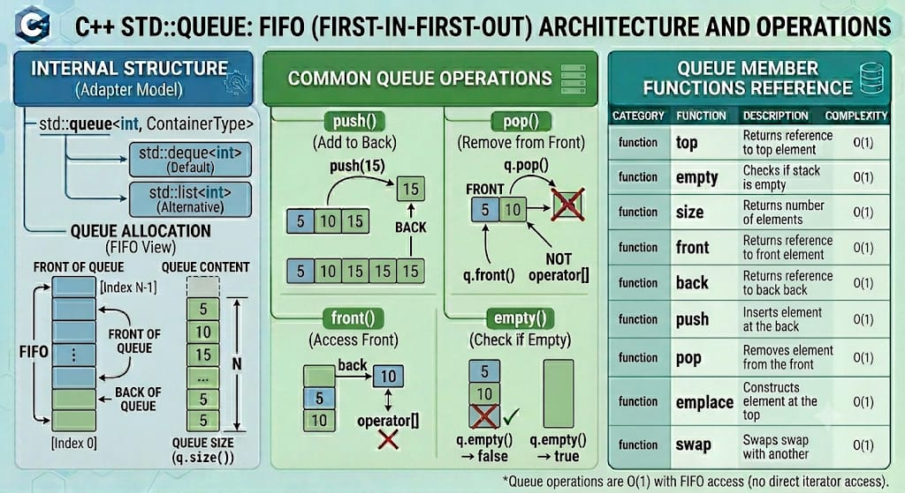

# QUEUE

`std::queue` is a container adaptor from the C++ Standard Library that gives the programmer the functionality of a **FIFO (First-In, First-Out)** data structure. It acts as a protective wrapper around an underlying sequence container, restricting direct access so that elements are pushed onto the back and popped from the front. This design pattern mirrors real-world waiting lines where the first item or person to arrive is always the first one served.

**Header:** `<queue>`

**Template:** `template< class T, class Container = std::deque<T> > class queue;`
*(By default, if no backing container is explicitly chosen, std::deque<T> is chosen as the underlying sequence storage engine).*




## High-level characteristics

- **FIFO data protocol**: Enforces a strict first-in, first-out sequencing interface. Elements are added at one end and pulled out from the other.
- **Container abstraction**: It does not allocate memory blocks directly. It adapts existing sequences that support specific operations, hiding arbitrary structural mechanics behind a clean interface.
- **Strict dual-ended access boundaries**: You can only directly inspect the very first item (`front()`) or the very latest item (`back()`). Indexing via `operator[]` or `.at()` is not permitted.
- **No iterator support**: Like `std::stack`, `std::queue` does not provide `begin()` or `end()` iterators, preventing mid-structure loops or arbitrary modifications.
- **Container limitations**: It can be backed by standard containers such as `std::deque` or `std::list`. It cannot be backed by `std::vector` because a vector lacks a fast `pop_front()` capability.

## How it works internally

Because `std::queue` is a container adaptor, it transforms a sequence container's standard operations into FIFO routines:
- `push(val)` maps internally to `container.push_back(val)`.
- `pop()` maps internally to `container.pop_front()`.
- `front()` maps internally to `container.front()`.
- `back()` maps internally to `container.back()`.

To fulfill these internal mappings, the custom or standard container passed as the second template argument must provide the four operations above. Both `std::deque` and `std::list` meet these requirements out-of-the-box:

```cpp
std::queue<int, std::list<int>> list_queue; // Operates smoothly using doubly-linked list nodes
```

**Exception safety**: 
- Reflects the exception properties of the underlying sequence container. Boundary shifts like `push` follow the strong exception guarantee of the wrapper container (e.g., reverting safely to original properties if `std::bad_alloc` occurs).


## Complexity guarantees

Complexity is bound entirely to the behaviors of the underlying structural implementation choice. For the default adapter (`std::deque`) and standard alternative (`std::list`):

| Operation | Complexity |
|-----------|-----------|
| `front` | O(1) |
| `back` | O(1) |
| `push` / `emplace` | O(1) |
| `pop` | O(1) |
| `size`, `capacity`, `empty` | O(1) |

## Member functions and operators

### Constructors

```cpp
queue();                                            // (1) default empty queue
explicit queue( const Container& cont );            // (2) copy-constructs underlying container from cont
explicit queue( Container&& cont );                 // (3) move-constructs underlying container from cont
queue( const queue& other );                        // (4) copy constructor
queue( queue&& other ) noexcept;                    // (5) move constructor

// Since C++23: range construction support
template< class InputIt >
queue( InputIt first, InputIt last );               // (6) range construct [first, last)
```

**Examples:**
```cpp
std::deque<int> d = {10, 20, 30};
std::queue<int> q1;                                 // empty queue backed by deque
std::queue<int> q2(d);                              // queue containing elements {10, 20, 30}

std::queue<int, std::list<int>> q3;                 // empty queue explicitly backed by a list
```

### Destructor

```cpp
~queue(); // Cleans up the queue along with every element managed within the backing container
```

### Assignment operators

```cpp
queue& operator=( const queue& other );             // copy assignment
queue& operator=( queue&& other ) noexcept;          // move assignment
```


### Element access

```cpp
T& front();                                         // reference to the oldest element (undefined if empty)
const T& front() const;

T& back();                                          // reference to the newest element (undefined if empty)
const T& back() const;
```

**Examples:**
```cpp
std::queue<int> q;
q.push(1);
q.push(2);

int oldest = q.front();                             // oldest = 1
int newest = q.back();                              // newest = 2
q.front() = 5;                                      // Alters the front element to 5 in-place
```

### Capacity

```cpp
bool empty() const;                                 // checks whether the queue contains no elements
size_type size() const;                             // returns the current element count
```

### Modifiers

#### push() / pop() — Modify boundaries

```cpp
void push( const T& value );                        // inserts element at the back
void push( T&& value );                             // moves element to the back
void pop();                                         // removes an element from the front (undefined if empty)
```

**Examples:**
```cpp
std::queue<std::string> printer_jobs;
printer_jobs.push("Doc1.pdf");                      // ["Doc1.pdf"]
printer_jobs.push("Doc2.pdf");                      // ["Doc1.pdf", "Doc2.pdf"]
printer_jobs.pop();                                 // Removes "Doc1.pdf", leaving ["Doc2.pdf"]
```

#### emplace() — Construct in-place at back

```cpp
template< class... Args >
decltype(auto) emplace( Args&&... args );           // constructs element at back via perfect forwarding
```

**Examples:**
```cpp
struct Customer {
    std::string name; int tier;
    Customer(std::string n, int t) : name(n), tier(t) {}
};

std::queue<Customer> counter;
counter.emplace("Alice", 3);                        // Avoids creation of a runtime temporary object
```
  
#### swap() — Exchange contents

```cpp
void swap( queue& other ) noexcept(/* conditional */); // Swaps underlying adapted structures instantly
```

### Comparison operators

```cpp
bool operator==( const queue& lhs, const queue& rhs );
bool operator!=( const queue& lhs, const queue& rhs );
bool operator< ( const queue& lhs, const queue& rhs );
bool operator<=( const queue& lhs, const queue& rhs );
bool operator> ( const queue& lhs, const queue& rhs );
bool operator>=( const queue& lhs, const queue& rhs );
```

## Iterator and reference invalidation rules

`std::queue` acts as a pass-through adaptor, so reference and iterator invalidation behaviors match the underlying container properties:

- `std::deque` **backing (Default)**: A `push` or `emplace` action invalidates any outer iterators, but all pointers and references to existing elements inside the queue remain stable. A `pop` action only invalidates pointers, references, and iterators linked to the element being removed.
- `std::list` **backing**: Modifying the boundaries does not alter pointers or references to other elements in memory. Only elements explicitly removed via `pop()` are invalidated.


## Typical pitfalls and best practices

1. **Operating on empty queues triggers Undefined Behavior**: Inspecting `.front()` or `.back()`, or invoking `.pop()` on an empty container adaptor results in a memory access crash. Always run a check on `q.empty()` beforehand.

2. **Incompatible underlying containers**: Avoid passing `std::vector` as the container template argument. A compilation error will occur because `std::vector` does not provide a `pop_front()` member function.

3. **No linear iterator scanning**: Do not choose a queue if you need to inspect elements in the middle of the container without discarding items at the front.


## Common idioms and patterns

### Clean consumption loop


```cpp
std::queue<int> task_queue;
// populate queue...

while(!task_queue.empty()) {
    int current_job = task_queue.front(); // Read oldest item safely
    
    // Process target logic...
    std::cout << "Executing sequence number: " << current_job << "\n";
    
    task_queue.pop();                     // Evict element from front
}
```

## Real-world use cases

- **Asynchronous network buffer channels**: Storing incoming data packets sequentially until a separate processing thread reads and dispatches them in their original order.
- **Breadth-First Search (BFS) graph algorithms**: Storing graph vertex exploration loops where neighboring nodes are queued up and processed in order of discovery.
- **Operating system print spoolers**: Managing a line of active documentation assets submitted to a printer, prioritizing them by arrival time.
- **Web server request pipelines**: Buffering incoming HTTP hits during peak request spikes, ensuring a fair, sequential response cycle for clients.
- Message queue, Dead letter Queue


## Useful headers and related features

| Header | Functionality |
|--------|---|
| `<queue>` | FIFO queue and priority queue container adapter |
| `<stack>` | LIFO adapter counterpart layer |

## Full example program

```cpp
#include <iostream>
#include <queue>
#include <list>
#include <string>

int main() {
    // Constructing a queue explicitly backed by a std::list container
    std::queue<std::string, std::list<std::string>> customer_line;

    // Simulate customers joining a bank service queue
    customer_line.push("Customer Alice");
    customer_line.push("Customer Bob");
    customer_line.push("Customer Charlie");

    std::cout << "Initial Queue Status: " << (customer_line.empty() ? "Empty" : "Active") << '\n';
    std::cout << "People waiting in line: " << customer_line.size() << '\n';
    std::cout << "First person to be served (Front): " << customer_line.front() << '\n';
    std::cout << "Last person who joined (Back): " << customer_line.back() << "\n\n";

    // Serve customers sequentially
    while (!customer_line.empty()) {
        std::cout << "Serving: " << customer_line.front() << '\n';
        customer_line.pop(); // Remove the customer from the front of the line
    }

    std::cout << "\nAll customers served. Remaining size: " << customer_line.size() << '\n';

    return 0;
}
```

**Output:**
```
Initial Queue Status: Active
People waiting in line: 3
First person to be served (Front): Customer Alice
Last person who joined (Back): Customer Charlie

Serving: Customer Alice
Serving: Customer Bob
Serving: Customer Charlie

All customers served. Remaining size: 0
```

---


