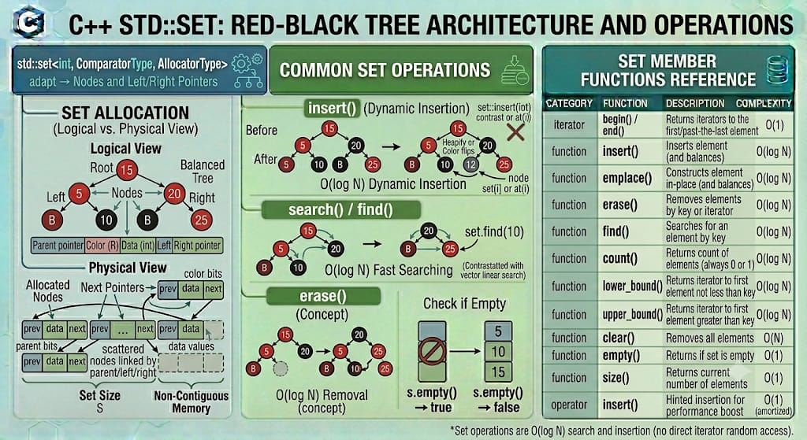

# SET

`std::set` is an associative container from the C++ Standard Library that contains a sorted collection of unique objects of type `Key`. Sorting is done automatically using a specified comparison function (by default, `std::less<Key>`). Search, insertion, and removal operations have logarithmic time complexity. Because the container is strictly ordered by its keys, elements cannot be modified directly once inserted; they must be extracted/erased and re-inserted.

**Header:** `<set>`

**Template:** `template< class Key, class Compare = std::less<Key>, class Allocator = std::allocator<Key>> class set;`




## High-level characteristics

- **Sorted elements**: Elements are always maintained in a strictly ordered sequence according to the `Compare` function.
- **Uniqueness strictly enforced**: A `std::set` cannot contain duplicate values. If you try to insert a value that already exists, the operation is simply ignored. (For duplicates, use `std::multiset`).
- **Immutable keys**: The values inside a set are treated as `const`. You cannot modify an element via its iterator because changing its value could alter its required sorted position, breaking the internal tree structure.
- **Associative structure**: Unlike sequence containers (`vector`, `list`), associative containers are optimized for rapid data retrieval based on keys. In a `std::set`, the value itself is the key.


## How it works internally

Internally, `std::set` is almost universally implemented as a **Red-Black Tree**, which is a type of self-balancing binary search tree.

- **Node-based allocation**: Every element is stored in its own dynamically allocated node, containing the payload, a "color" flag (red or black), and three structural pointers (parent, left child, right child).
- **Self-Balancing math**: When elements are inserted or removed, the tree performs mathematical color-flipping and pointer rotations to ensure the longest path from the root to a leaf is no more than twice the shortest path. This guarantees $O(\log n)$ worst-case tree depth.

Because elements are spread across scattered heap nodes, `std::set` does not support random access (`operator[]` is completely invalid). Traversal requires stepping sequentially through the binary tree via in-order traversal.

**Exception safety**:
- `std::set` provides strong exception guarantees. If a single-element `insert()` throws an exception (e.g., `std::bad_alloc` when creating a node), the tree structure remains entirely unchanged.

## Complexity guarantees

| Operation | Complexity |
|-----------|-----------|
| Lookup (`find, contains, count`) | O(log N) |
| Insertion (`insert, emplace`) | O(log N) |
| Erasure by value | O(log N) |
| Erasure by iterator | Amortized O(1) |
| `size`, `empty` | O(1) |
| `clear` | O(N) (sequentially calls destructors and deallocates every node) |

## Member functions and operators

### Constructors

```cpp
set();                                              // (1) empty set
explicit set( const Compare& comp );                // (2) empty set with custom comparator
template< class InputIt >
set( InputIt first, InputIt last );                 // (3) range [first, last)
set( const set& other );                            // (4) copy constructor
set( set&& other ) noexcept;                        // (5) move constructor
set( std::initializer_list<value_type> init );      // (6) initializer list
```


**Examples:**
```cpp
std::set<int> s1;                                   // empty
std::set<int> s2 = {4, 1, 3, 2, 3};                 // {1, 2, 3, 4} (sorted, duplicates dropped)
std::vector<int> v = {10, 10, 20};
std::set<int> s3(v.begin(), v.end());               // {10, 20}
std::set<int, std::greater<int>> s4 = {1, 2, 3};    // {3, 2, 1} (custom descending order)
```

### Destructor

```cpp
~set(); // Destroys all nodes and frees heap allocations
```


### Element access

- Because a `std::set` manages its own internal sorting, it does NOT provide `operator[]`, `.at()`, `.front()`, or `.back()`. Elements must be accessed via Iterators or Lookup functions.


### Iterators

```cpp
iterator begin() noexcept;                          // iterator to the smallest element
const_iterator begin() const noexcept;
iterator end() noexcept;                            // iterator to end (one-past-largest)
const_iterator end() const noexcept;

reverse_iterator rbegin() noexcept;                 // reverse iterator (points to largest element)
reverse_iterator rend() noexcept;                   // reverse iterator to beginning
```

**Examples:**
```cpp
std::set<int> s = {5, 2, 8};

for(auto it = s.begin(); it != s.end(); ++it) {
    std::cout << *it << ' ';                        // 2 5 8
}
```

### Capacity

```cpp
bool empty() const noexcept;                        // checks if size == 0
size_type size() const noexcept;                    // number of unique elements
size_type max_size() const noexcept;                // maximum theoretical size
```


### Modifiers

#### clear() — Remove all elements

```cpp
void clear() noexcept; // Iterates and deallocates every node
```

#### insert() — Insert elements

```cpp
std::pair<iterator, bool> insert( const value_type& value );  // inserts value if it doesn't exist
iterator insert( const_iterator hint, const value_type& value ); // inserts with a position hint
template< class InputIt >
void insert( InputIt first, InputIt last );                   // inserts a range
void insert( std::initializer_list<value_type> ilist );       // inserts initializer list
```


**Examples:**
```cpp
std::set<int> s;
auto [it1, inserted1] = s.insert(10); // inserted1 = true, it1 points to 10
auto [it2, inserted2] = s.insert(10); // inserted2 = false (duplicate), it2 points to existing 10
```

#### emplace() — Construct and insert in-place

```cpp
template< class... Args >
std::pair<iterator, bool> emplace( Args&&... args );
```

#### erase() — Remove elements

```cpp
iterator erase( const_iterator pos );                 // erase element at iterator (Amortized O(1))
iterator erase( const_iterator first, const_iterator last ); // erase range
size_type erase( const key_type& key );               // erase by value (O(log N)), returns 1 if erased, 0 if not
```


#### extract() and merge() (C++17) — Node manipulation

```cpp
node_type extract( const_iterator position );         // unlinks a node from the tree without destroying it
node_type extract( const key_type& x );               // unlinks by key
void merge( set& source );                            // moves nodes from another set into this one without reallocation
```

#### Lookup

```cpp
size_type count( const Key& key ) const;              // returns 1 if found, 0 if not
iterator find( const Key& key );                      // returns iterator to element, or end() if not found
bool contains( const Key& key ) const;                // (C++20) returns true if element exists

iterator lower_bound( const Key& key );               // iterator to first element >= key
iterator upper_bound( const Key& key );               // iterator to first element > key
std::pair<iterator,iterator> equal_range( const Key& key ); // pair of {lower_bound, upper_bound}
```


## Iterator and reference invalidation rules

Because `std::set` allocates nodes dynamically and links them via pointers, its invalidation properties are extremely stable:

| Operation | Invalidation |
|-----------|---|
| `insert` / `emplace` | None. Existing pointers, references, and iterators remain perfectly valid. |
| `extract` | Only iterators to the extracted node are invalidated. References and pointers to the extracted node remain valid. |
| `merge` | Iterators to merged nodes are invalidated. Pointers and references remain valid. |
| `erase` | Only the erased elements are invalidated. |
| `clear` / Destruction | All pointers, references, and iterators are invalidated. |    


**Key takeaway:** Adding or removing items from a `std::set` never shifts other items in memory..

## Typical pitfalls and best practices

1. **Never use `std::find` on a set**: The `<algorithm>` version of `std::find` does a linear $O(N)$ scan. Always use the member function `s.find(value)` or `s.contains(value)`, which leverages the internal tree for a lightning-fast $O(\log N)$ binary search.

2. **Modifying elements**: Because you cannot modify a `std::set` element directly (it is `const`), if you need to update a value, you must `erase()` it and `insert()` the new value. (Alternatively, in C++17, use `.extract()` to pull the node out, modify its `.value()`, and `.insert()` it back without reallocating memory).

3. **Use `std::unordered_set` if order doesn't matter": If you only need to guarantee uniqueness and check for existence, `std::unordered_set` (Hash Table) provides $O(1)$ average lookups, heavily outperforming the $O(\log N)$ Red-Black tree of `std::set`. Only use `std::set` if you actively need the elements sorted.

4. **Heavy copy overhead**: Because every insertion requires a separate heap allocation and tree rebalancing math, building a massive `std::set` element-by-element is significantly slower than building a `std::vector` and running `std::sort()` followed by `std::unique()`.


## Common idioms and patterns

### Deduplicating a vector


```cpp
std::vector<int> v = {1, 5, 2, 5, 1, 8};

// Dump vector into set to auto-sort and remove duplicates
std::set<int> unique_elements(v.begin(), v.end());

// Re-assign back to vector
v.assign(unique_elements.begin(), unique_elements.end());
// v is now {1, 2, 5, 8}
```

### Modifying a set element without reallocation (C++17)

```cpp
std::set<int> my_set = {10, 20, 30};

auto node = my_set.extract(20); // Unlinks '20' from tree
if (!node.empty()) {
    node.value() = 25;          // Safely modify the unlinked node
    my_set.insert(std::move(node)); // Re-insert it into the tree
}
// my_set is now {10, 25, 30}
```


## Real-world use cases

- **Collision detection & Sweep-line algorithms**: Used heavily in computational geometry to track active line segments sorted by Y-coordinates.

- **Priority Event Schedulers**: Maintaining a sorted list of upcoming timestamped events where events can be dynamically inserted or cancelled.
  
- **Unique Tag Systems**: Storing metadata tags for articles or files where identical tags must be ignored and the output must be displayed alphabetically.

- **Graph Algorithms**: Keeping track of unvisited/visited nodes or maintaining the active search frontier in algorithms like Dijkstra's (though `priority_queue` is often preferred).


## Useful headers and related features

| Header | Functionality |
|--------|---|
| `<set>` | Provides `std::set` and `std::multiset` |
| `<unordered_set>` | Hash-table based equivalent (faster lookups, no ordering) |
| `<map>` | Red-Black Tree for Key-Value pairs |


## Full example program

```cpp
#include <iostream>
#include <set>
#include <string>

// Custom structure for our set
struct User {
    int id;
    std::string name;

    // Sets require a less-than operator to know how to sort the tree
    bool operator<(const User& other) const {
        return id < other.id; // Sort by ID
    }
};

int main() {
    // 1. Initialization and automated sorting
    std::set<int> scores = {85, 92, 78, 100, 92, 85}; // Duplicates 92 and 85 are ignored

    std::cout << "Unique and Sorted Scores: ";
    for (int s : scores) std::cout << s << " ";
    std::cout << "\n\n";

    // 2. Fast O(log N) Lookup
    int target = 100;
    
    // C++20 .contains() method (cleaner than using .find() == .end())
    if (scores.contains(target)) {
        std::cout << "Perfect score of " << target << " was found!\n\n";
    }

    // 3. Working with custom objects
    std::set<User> user_database;
    user_database.insert({502, "Alice"});
    user_database.insert({101, "Bob"});
    user_database.insert({304, "Charlie"});

    // Notice that attempting to insert Bob's ID again fails gracefully
    auto [iterator, success] = user_database.insert({101, "David (Hacker)"});
    
    if (!success) {
        std::cout << "Blocked duplicate ID 101. Existing user is: " << iterator->name << "\n\n";
    }

    // 4. Traversal guarantees sorted order
    std::cout << "Active User Database (Sorted by ID):\n";
    for (const auto& user : user_database) {
        std::cout << "ID: " << user.id << " | Name: " << user.name << '\n';
    }

    // 5. Using lower_bound to find elements greater than or equal to a value
    auto lb = scores.lower_bound(80);
    std::cout << "\nFirst score >= 80 is: " << *lb << '\n';

    return 0;
}
```

**Output:**
```
Unique and Sorted Scores: 78 85 92 100 

Perfect score of 100 was found!

Blocked duplicate ID 101. Existing user is: Bob

Active User Database (Sorted by ID):
ID: 101 | Name: Bob
ID: 304 | Name: Charlie
ID: 502 | Name: Alice

First score >= 80 is: 85
```

---


