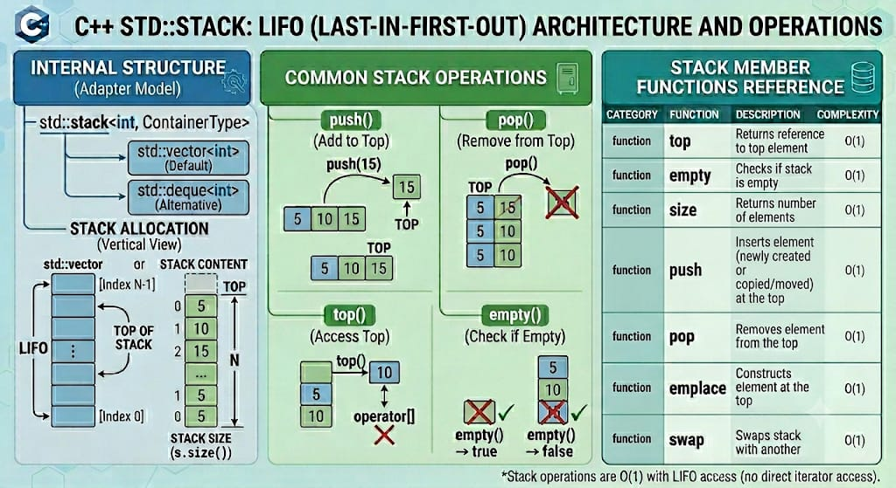

# STACK  

`std::stack` is a container adaptor from the C++ Standard Library that gives the programmer the functionality of a LIFO (Last-In, First-Out) data structure. Unlike sequence containers such as `std::vector` or `std::deque`, `std::stack` does not manage storage directly. Instead, it acts as a wrapper (adaptor) around an underlying sequence container, exposing a restricted, specific interface that only permits operations at the "top" of the structure.

**Header:** `<stack>`

**Template:** `template< class T, class Container = std::deque > class stack;`
*(By default, if no backing container is specified, `std::deque<T>` is used as the underlying storage mechanism).*




## High-level characteristics

- **LIFO data protocol**: Elements are inserted and extracted from the same end. The last item added is always the first item retrieved.
- **Container abstraction**: It is not a distinct data structure with an independent allocation model; it wraps around existing containers like `std::deque`, `std::vector`, or `std::list`.
- **Restricted access interface**: Direct arbitrary indexing via `operator[]` or `.at()` is completely banned. It does not expose iterators; you cannot loop through a stack without clearing or popping its elements.
- **Predictable boundary management**: Provides basic, strict operations: `push`, `pop`, and `top`.
- **Value shifting safety**: Inherits the performance characteristics and memory optimizations of whatever container it wraps.

## How it works internally

Because `std::stack` acts as an adapter, it simply maps its public member functions directly to the matching boundary mechanisms of its underlying container:
- **`push(val)`** invokes `container.push_back(val)` internally.
- **`pop()`** invokes `container.pop_back()` internally.
- **`top()`** returns a reference to `container.back()`.

If you choose a different underlying container, the stack shifts its interface logic seamlessly:
```cpp
std::stack<int, std::vector<int>> vector_stack; // Uses vector mechanics
std::stack<int, std::list<int>> list_stack;     // Uses doubly-linked list mechanics
```
Choosing `std::vector` as the underlying container eliminates the ability to perform front modifications, but because `std::stack` only relies on `back()` operations, it functions without issue.

**Exception safety**: 
- Matches the exception guarantees of the underlying container's operations (e.g., `push` mirrors the strong exception guarantee of `push_back`).


## Complexity guarantees

Complexity depends entirely on the underlying container. For the default container `(std::deque)` and standard alternatives (`std::vector`, `std::list`):

| Operation | Complexity |
|-----------|-----------|
| `top` | O(1) |
| `pop` | O(1) |
| `push` / `emplace` | O(1) (amortized constant for vector backing) |
| `size`, `capacity`, `empty` | O(1) |

## Member functions and operators

### Constructors

```cpp
stack();                                            // (1) default empty stack
explicit stack( const Container& cont );            // (2) copies contents of cont into storage
explicit stack( Container&& cont );                 // (3) moves contents of cont into storage
stack( const stack& other );                        // (4) copy constructor
stack( stack&& other ) noexcept;                    // (5) move constructor
```

**Examples:**
```cpp
std::deque<int> d = {1, 2, 3};
std::stack<int> s1;                                 // empty stack backed by deque
std::stack<int> s2(d);                              // stack populated with elements {1, 2, 3}

std::stack<int, std::vector<int>> s3;               // empty stack explicitly backed by vector
```

### Destructor

```cpp
~stack(); // Destroys the stack object along with all elements inside the underlying container
```

### Assignment operators

```cpp
stack& operator=( const stack& other );             // copy assignment
stack& operator=( stack&& other ) noexcept;          // move assignment
```


### Element access

```cpp
T& top();                                           // reference to the top element (undefined if empty)
const T& top() const;
```

**Examples:**
```cpp
std::stack<int> s;
s.push(100);
s.push(200);

int current_top = s.top();                         // current_top = 200
s.top() = 300;                                     // Modifies the top element directly in-place
```

### Capacity

```cpp
bool empty() const;                                 // checks whether the stack is empty
size_type size() const;                             // returns the number of elements
```

### Modifiers

#### push() / pop() — Add/remove at top

```cpp
void push( const T& value );                        // copy element to the top
void push( T&& value );                             // move element to the top
void pop();                                         // remove the top element (undefined if empty)
```

**Examples:**
```cpp
std::stack<std::string> cards;
cards.push("Ace");                                  // ["Ace"]
cards.push("King");                                 // ["Ace", "King"]
cards.pop();                                        // Removes "King", leaving ["Ace"]
```

#### emplace() — Construct in-place at top

```cpp
template< class... Args >
decltype(auto) emplace( Args&&... args );           // construct element at top with perfect forwarding
```

**Examples:**
```cpp
struct Widget {
    int id; std::string code;
    Widget(int id, std::string code) : id(id), code(code) {}
};

std::stack<Widget> storage;
storage.emplace(42, "TX-A");                        // Constructs Widget inline, zero temporaries
```
  
#### swap() — Exchange contents

```cpp
void swap( stack& other ) noexcept(/* conditional */); // Swaps underlying adapted containers instantly
```

### Comparison operators

```cpp
bool operator==( const stack& lhs, const stack& rhs );
bool operator!=( const stack& lhs, const stack& rhs );
bool operator< ( const stack& lhs, const stack& rhs );
bool operator<=( const stack& lhs, const stack& rhs );
bool operator> ( const stack& lhs, const stack& rhs );
bool operator>=( const stack& lhs, const stack& rhs );
```

## Iterator and reference invalidation rules

Because `std::stack` is an adapter, it does not introduce independent invalidation behaviors. Invalidation tracking is determined entirely by the underlying container type:

- `std::deque` **backing (Default)**: Pushing or popping elements changes the top boundaries. Iterators would be broken if they existed, but pointers and references to untouched elements remain valid.
- `std::vector` **backing**: If a `push` prompts a memory reallocation, all references, pointers, and iterators to any element in the container are instantly invalidated.


## Typical pitfalls and best practices

1. **Popping or reading an empty stack causes Undefined Behavior**: Calling `.top()` or `.pop()` on an empty stack results in a runtime crash or memory corruption. Always check `s.empty()` beforehand.

2. **Missing container operations**: Do not attempt to use `begin()`, `end()`, or access elements by index. If you need traversal capabilities, do not adapt your structure to a stack.

3. **No direct bulk initialization**: You cannot directly initialize a stack via a brace-enclosed initializer list (e.g., `std::stack<int> s = {1, 2, 3};` is invalid). Populate a backing container first and pass it to the constructor.


## Common idioms and patterns

### Safe inspection loop


```cpp
std::stack<int> process_stack;
// fill stack...

while(!process_stack.empty()) {
    int target = process_stack.top(); // Safe access
    
    // Perform operations...
    std::cout << "Processing: " << target << "\n";
    
    process_stack.pop();              // Remove from structure sequentially
}
```

## Real-world use cases

- **Compiler expression parsing & matching**: Validating nested syntactic balance parameters, such as tracking matching parentheses `()`, brackets `[]`, and braces `{}` in source code.
- **Call stack trace tracking**: Operating system runtime routines tracing memory allocations, function calls, and activation records.
- **Backtracking algorithms**: Graph search configurations such as Depth-First Search (DFS) pathways or labyrinth traversal scripts tracking historical steps.
- **Text editor undo frameworks**: Back-buffering actions where clicking "Undo" pops the most recent mutation command out of the state manager.


## Useful headers and related features

| Header | Functionality |
|--------|---|
| `<stack>` | LIFO stack container adaptor |
| `<queue>` | FIFO queue and priority queue adapter counterparts |

## Full example program

```cpp
#include <iostream>
#include <stack>
#include <vector>
#include <string>

int main() {
    // Creating a stack explicitly backed by a std::vector container
    std::stack<std::string, std::vector<std::string>> browser_history;

    // Simulate navigating to web pages
    browser_history.push("google.com");
    browser_history.push("cppreference.com");
    browser_history.push("github.com");

    std::cout << "Current History Size: " << browser_history.size() << '\n';
    std::cout << "Active Page (Top): " << browser_history.top() << "\n\n";

    // Simulate clicking the "Back" button twice
    if (!browser_history.empty()) {
        std::cout << "Clicking BACK... leaving: " << browser_history.top() << '\n';
        browser_history.pop();
    }

    if (!browser_history.empty()) {
        std::cout << "Clicking BACK... leaving: " << browser_history.top() << '\n';
        browser_history.pop();
    }

    std::cout << "\nReturned to page: " << browser_history.top() << '\n';
    std::cout << "Remaining history depth: " << browser_history.size() << '\n';

    return 0;
}
```

**Output:**
```
Current History Size: 3
Active Page (Top): github.com

Clicking BACK... leaving: github.com
Clicking BACK... leaving: cppreference.com

Returned to page: google.com
Remaining history depth: 1
```

---

