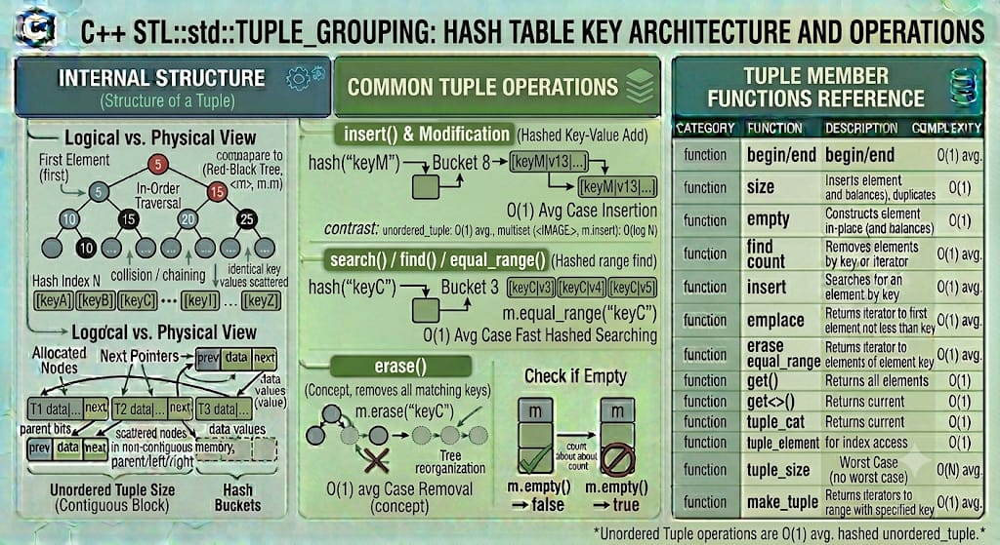

# TUPLE

`std::tuple` is a fixed-size structural class template from the C++ Standard Library that groups multiple heterogeneous values together. It is a direct generalization of `std::pair`, expanding the concept to hold zero, one, two, or any arbitrary number of elements. Like `std::pair`, it is not a traditional container, but a utility data structure frequently used to return multiple values or bundle data without writing a custom struct.

**Header:** `<tuple>`

**Template:** 
```cpp
template< class... Types > 
class tuple;
```



## High-level characteristics

- **Variadic and Heterogeneous**: A tuple can hold any number of elements, and each element can be a completely different data type (e.g., `std::tuple<int, double, std::string, char>`).
- **Compile-Time Sizing**: The size and types of a tuple are fixed at compile time. You cannot add or remove elements dynamically at runtime.
- **Index-Based Access**: Because it lacks named members (unlike `.first` and `.second` in `std::pair`), elements are accessed via compile-time indexing using `std::get<I>(tuple)`.
- **Value Semantics**: Tuples can be copied, moved, compared, and passed by value seamlessly, delegating to the underlying element types.
- **Deeply Integrated**: std::tuple forms the backbone of modern C++ features like C++17 Structured Bindings and parameter pack expansions.

## How it works internally

Internally, `std::tuple` relies heavily on Variadic Templates and Recursive Inheritance (or recursive struct aggregation).

A simplified conceptual view of its implementation is a structure that inherits from another structure representing the rest of the tuple:

```cpp
template <typename T, typename... Rest>
struct tuple <T, Rest...> : public tuple<Rest...> {
    T value;
};
```
- Because of this recursive inheritance, the memory layout of a tuple is completely flat. Furthermore, standard library implementations utilize the Empty Base Optimization (EBO). If a tuple contains empty classes or structs, they consume exactly zero bytes of space in the tuple layout.

There are no dynamic allocations, tracking pointers, or capacity metrics inherently attached to a tuple.


## Complexity guarantees

Because it is purely a compile-time variadic struct, operations on a `std::tuple` have zero runtime lookup cost:

| Operation | Complexity |
|-----------|-----------|
| Access (`std::get`) | O(1) (Resolved entirely at compile time) |
| Construction / Initialization | O(1)  |
| Copy / Move | O(1) (Linear with respect to the number of elements, executing consecutively) |
| Swap | O(1) |


## Member functions and operators

### Constructors

```cpp
tuple();                                            // (1) default constructor
explicit tuple( const Types&... args );             // (2) direct initialization from values
template< class... UTypes >
explicit tuple( UTypes&&... args );                 // (3) perfect forwarding constructor
tuple( const tuple& other ) = default;              // (4) copy constructor
tuple( tuple&& other ) = default;                   // (5) move constructor
template< class U1, class U2 >
tuple( const std::pair<U1, U2>& p );                // (6) constructs a 2-element tuple from a pair
```

**Examples:**
```cpp
std::tuple<int, double, std::string> t1;            // {0, 0.0, ""}
std::tuple<int, double> t2(42, 3.14);               // Direct initialization

// C++17 Class Template Argument Deduction (CTAD)
std::tuple t3(10, "Hello", 5.5f);                   // Deduces std::tuple<int, const char*, float>
```

### Tuple Creation Helpers

```cpp
// Creates a tuple, deducing types automatically (decays references)
template< class... Types >
std::tuple<VTypes...> make_tuple( Types&&... args );

// Creates a tuple of lvalue references (used for unpacking)
template< class... Types >
std::tuple<Types&...> tie( Types&... args );

// Creates a tuple of rvalue and lvalue references (perfect forwarding parameters)
template< class... Types >
std::tuple<Types&&...> forward_as_tuple( Types&&... args );
```

**Examples**
```cpp
auto t = std::make_tuple(1, 2.5, "A");              // std::tuple<int, double, const char*>

int a, b;
std::tie(a, std::ignore, b) = std::make_tuple(1, 2, 3); // Unpacks 1 into 'a', 3 into 'b', ignores 2
```
  
### Element Access

```cpp
// (C++11) Access by compile-time index
template< std::size_t I, class... Types >
constexpr std::tuple_element_t<I, tuple<Types...>>& get( tuple<Types...>& t ) noexcept;

// (C++14) Access by unique type
template< class T, class... Types >
constexpr T& get( tuple<Types...>& t ) noexcept;
```

**Examples**
```cpp
std::tuple<int, double, std::string> t(10, 3.14, "Apple");

int x = std::get<0>(t);                             // x = 10
std::string y = std::get<std::string>(t);           // y = "Apple" (C++14 feature)
// int z = std::get<int>(t);                        // Compilation error if tuple had two 'int's!
```

### Advanced Tuple Operations

```cpp
// (1) Concatenate multiple tuples into one massive tuple
template< class... Tuples >
constexpr std::tuple<...> tuple_cat( Tuples&&... args );

// (2) Invoke a function using a tuple as its arguments (C++17)
template< class F, class Tuple >
constexpr decltype(auto) apply( F&& f, Tuple&& t );

// (3) Construct an object using a tuple as constructor arguments (C++17)
template< class T, class Tuple >
constexpr T make_from_tuple( Tuple&& t );
```

**Examples**

```cpp
auto t1 = std::make_tuple(1, 2);
auto t2 = std::make_tuple(3.3, "Hi");
auto combined = std::tuple_cat(t1, t2);             // tuple<int, int, double, const char*>

void print_sum(int a, int b) { std::cout << a + b; }
std::apply(print_sum, t1);                          // Unpacks t1 and calls print_sum(1, 2)
```


## Typical pitfalls and best practices

1. **`std::get` requires Compile-Time Constants**: You cannot pass a dynamic runtime variable to `std::get. int i = 1; std::get<i>(t)`; will throw a compiler error. The index must be a `constexpr`.

2. **Compile-Time Overhead**: Because `std::tuple` relies on heavy template recursion, creating gigantic tuples (e.g., hundreds of elements) can severely inflate your compile times.

3. **Prefer Structs for Domain Logic**: Just like `std::pair`, if a tuple represents a concrete concept (e.g., `std::tuple<std::string, std::string, int>` for `FirstName, LastName, Age`), define a `struct Person` instead. Use tuples for generic glue code, variadic template infrastructure, and transient return values.

4. **Structured Bindings vs `std::tie`**: In C++17, always prefer Structured Bindings (`auto [a, b, c] = get_tuple();`) over `std::tie`. Structured bindings are cleaner, automatically deduce types, and don't require pre-declaring uninitialized variables.


## Common idioms and patterns

### Returning multiple values (Modern C++17 pattern)

```cpp
std::tuple<bool, int, std::string> process_data() {
    // ... complex logic
    return {true, 404, "Not Found"};
}

// Unpacking directly via Structured Bindings
auto [success, code, message] = process_data();
```

### Emulating Python's zip using tuples

You can iterate over multiple containers simultaneously using an index and a tuple of references:

```cpp
std::vector<int> v1 = {1, 2, 3};
std::vector<double> v2 = {1.1, 2.2, 3.3};

for (size_t i = 0; i < v1.size(); ++i) {
    auto t = std::tie(v1[i], v2[i]); // Tuple of references
    std::get<0>(t) += 10;            // Modifies v1 natively
}
```

## Real-world use cases

- **Database Connectors**: Retrieving a row from a database query where each column is a different SQL data type (e.g., mapping an SQL row to `std::tuple<int, std::string, double>`).
- **Thread Pools & Async Callbacks**: Packing a function pointer and an arbitrary number of arguments into a single `std::tuple` object to be executed later on a different thread using `std::apply`.
- **Lexicographical Tie-Breaking**: Comparing complex custom objects by bundling their fields into a tuple, leveraging the tuple's built-in `operator<` to do sequential tie-breaker evaluations.
- **Variadic Template Metaprogramming**: Using `std::tuple` as a compile-time type-list container to manipulate packs of types before generating actual code.


## Useful headers and related features

| Header | Functionality |
|--------|---|
| `<tuple>` | Provides `std::tuple, std::make_tuple, std::apply`, etc. |
| `<utility>` | Provides `std::pair` (the 2-element predecessor to tuple)|
| `<type_traits>` | Used for metaprogramming around tuple boundaries |


## Full example program

```cpp
#include <iostream>
#include <tuple>
#include <string>

// A function returning three distinct pieces of data
std::tuple<std::string, double, int> get_product_info() {
    return {"Mechanical Keyboard", 129.99, 50};
}

// A function meant to be invoked via std::apply
void display_inventory(const std::string& name, double price, int stock) {
    std::cout << "Item: " << name << "\nPrice: $" << price << "\nStock: " << stock << "\n\n";
}

int main() {
    // 1. Basic initialization and type deduction
    auto product = get_product_info();

    // 2. Accessing elements using std::get (Index and Type based)
    std::string name = std::get<0>(product);
    double price = std::get<1>(product);
    int stock = std::get<int>(product); // C++14 access by unique type

    std::cout << "Accessed via std::get:\n" << name << " | $" << price << " | qty: " << stock << "\n\n";

    // 3. C++17 Structured Bindings (The cleanest way to unpack)
    auto [n, p, s] = get_product_info();
    std::cout << "Accessed via Structured Bindings:\n" << n << " | $" << p << " | qty: " << s << "\n\n";

    // 4. Using std::tie (The pre-C++17 way, useful for ignoring fields)
    int count;
    std::tie(std::ignore, std::ignore, count) = get_product_info();
    std::cout << "Extracted only the count using std::tie: " << count << "\n\n";

    // 5. Modifying tuple elements directly
    std::get<1>(product) = 99.99; // Discount the price

    // 6. Invoking a function with a tuple using std::apply
    std::cout << "--- Apply Function Result ---\n";
    std::apply(display_inventory, product);

    // 7. Tuple Concatenation
    auto t1 = std::make_tuple("Alice", 25);
    auto t2 = std::make_tuple("Engineer", true);
    auto combined = std::tuple_cat(t1, t2); // Result: std::tuple<const char*, int, const char*, bool>

    std::cout << "Concatenated tuple size: " << std::tuple_size_v<decltype(combined)> << "\n";

    return 0;
}
```

**Output:**
```
Accessed via std::get:
Mechanical Keyboard | $129.99 | qty: 50

Accessed via Structured Bindings:
Mechanical Keyboard | $129.99 | qty: 50

Extracted only the count using std::tie: 50

--- Apply Function Result ---
Item: Mechanical Keyboard
Price: $99.99
Stock: 50

Concatenated tuple size: 4
```

---


