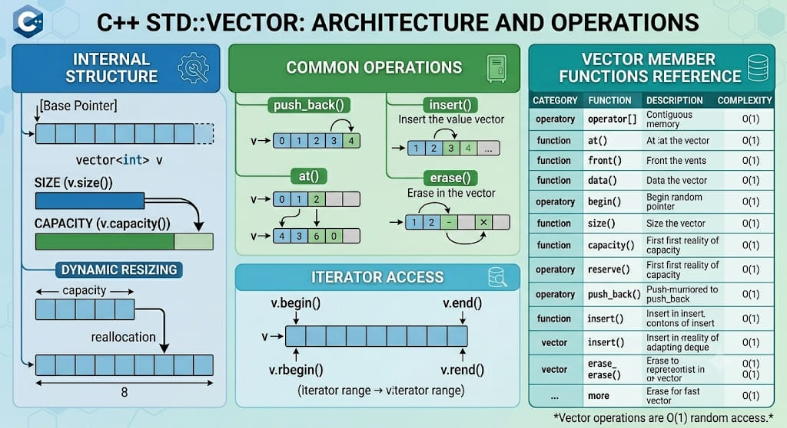

# std::vector — Detailed Guide



## Definition

`std::vector<T>` is a sequence container from the C++ Standard Library that encapsulates dynamic size arrays. It stores elements contiguously in memory (like a C array) and manages storage automatically. Vectors provide random-access iterators and allow efficient access by index.

## High-level characteristics

- Contiguous storage: elements are stored in a single dynamically allocated contiguous block.
- Size vs Capacity:
  - size(): number of elements currently in the vector.
  - capacity(): number of elements the vector can hold without reallocating.
- Amortized constant time for push_back.
- Iterator invalidation: many modifying operations can invalidate iterators, references, and pointers to elements.

## How it works internally

Internally, a `std::vector` typically manages three pointers (or pointer-like members):
- pointer to the start of allocated storage (begin)
- pointer to one-past-the-last element currently contained (end)
- pointer to one-past-the-last allocated slot (end_of_capacity)

When you push_back and size() == capacity(), the vector allocates a larger block of memory (implementation-defined growth strategy, often doubling or 1.5x growth), moves or copies the existing elements into the new memory, destroys the old elements and deallocates the previous block. This reallocation is why references, pointers, and iterators to elements can be invalidated.

Growth strategy varies by standard library implementation; typical properties:
- Reserve growth to reduce reallocations when size growth is predictable.
- Reallocation cost is O(N) but amortized cost of push_back is O(1).

Exception safety: operations that allocate memory (insert, push_back when capacity exhausted) may throw bad_alloc; vector provides the strong exception guarantee for many operations when element move/copy constructors don't throw.

## Complexity guarantees (common)

- Access by index: O(1).
- push_back (amortized): O(1).
- pop_back: O(1).
- insert/erase at arbitrary position: O(N) (linear) due to element shifting.
- reserve: O(N) if it causes reallocation, otherwise O(1).

## Member functions and operators

Below is a list of commonly used member functions and operators with descriptions and examples.

- Constructors
  - vector() noexcept; // empty
  - explicit vector(size_type n, const T& val = T());
  - template< class InputIt > vector(InputIt first, InputIt last);
  - vector(const vector& other);
  - vector(vector&& other) noexcept;

  Example:
  ```cpp
  std::vector<int> a;               // empty
  std::vector<int> b(5, 42);        // {42, 42, 42, 42, 42}
  std::vector<int> c(b.begin(), b.end());
  std::vector<int> d(std::move(b));
  ```

- Destructor
  - ~vector(); // destroys all elements and deallocates storage

- Assignment
  - operator=(const vector&);
  - operator=(vector&&) noexcept;
  - assign(count, value);
  - assign(first, last);

  Example:
  ```cpp
  std::vector<int> v;
  v.assign(3, 7); // {7,7,7}
  ```

- Element access
  - at(size_type pos): returns reference with bounds checking (throws std::out_of_range).
  - operator[](size_type pos): unchecked access.
  - front(): reference to first element (undefined if empty).
  - back(): reference to last element (undefined if empty).
  - data(): returns pointer to contiguous array (T*).

  Example:
  ```cpp
  std::vector<int> v = {1,2,3};
  int x = v[1];        // 2
  int y = v.at(2);     // 3
  int* raw = v.data(); // usable with C APIs
  ```

- Iterators
  - begin(), end(), rbegin(), rend(), cbegin(), cend(), crbegin(), crend()

  Example:
  ```cpp
  for(auto it = v.begin(); it != v.end(); ++it) {
      // use *it
  }
  ```

- Capacity
  - empty(): whether size() == 0
  - size(): number of elements
  - max_size(): theoretical max elements
  - reserve(size_type new_cap): ensure capacity >= new_cap
  - capacity(): current allocated capacity
  - shrink_to_fit(): non-binding request to reduce capacity to fit size

  Example:
  ```cpp
  std::vector<int> v;
  v.reserve(100); // reduce reallocations when pushing many items
  ```

- Modifiers
  - clear(): removes all elements but does not change capacity
  - push_back(const T&), push_back(T&&): append element
  - emplace_back(Args&&...): construct in-place at the end
  - pop_back(): remove last element
  - insert(iterator pos, const T& val);
  - insert(iterator pos, T&& val);
  - insert(iterator pos, size_type count, const T& val);
  - insert(iterator pos, InputIt first, InputIt last);
  - erase(iterator pos); erase(iterator first, iterator last);
  - emplace(iterator pos, Args&&... args);
  - swap(vector& other) noexcept; // fast swap of internals

  Examples:
  ```cpp
  std::vector<std::string> names;
  names.push_back("Alice");
  names.emplace_back("Bob");

  // insert at position
  auto it = names.begin() + 1;
  names.insert(it, "Carol");

  // erase
  names.erase(names.begin());
  ```

- Non-member swap
  - swap(vector<T>& a, vector<T>& b) noexcept;

- Relational operators (lexicographical comparison)
  - operator==, !=, <, <=, >, >=

  Example:
  ```cpp
  if (a == b) { /* same content */ }
  if (a < b) { /* lexicographically less */ }
  ```

## Iterator and reference invalidation rules (summary)

- push_back / emplace_back: may reallocate -> all iterators/references/pointers invalidated. If no reallocation, only end iterator invalidated.
- insert/erase at any position: elements after insertion/erase point are shifted -> iterators and references to them are invalidated.
- reserve: may reallocate -> all iterators/references/pointers invalidated.
- clear: invalidates iterators but does not change capacity.

Details are implementation-defined but follow the general rules above.

## Typical pitfalls and best practices

- If you know the number of elements, call reserve(n) to avoid repeated reallocations.
- Prefer emplace_back when constructing elements in-place to avoid unnecessary copies/moves.
- If you need stable references/iterators across insertions/removals, use std::list or std::deque (deque still has some invalidation properties).
- Use shrink_to_fit only if memory is a concern — it's a non-binding request and may or may not reduce capacity.

## Example implementations and idioms

- Building a vector with reserved capacity

```cpp
#include <vector>

std::vector<int> make_range(int n) {
    std::vector<int> v;
    v.reserve(n);
    for (int i = 0; i < n; ++i) v.push_back(i);
    return v; // move elision / move
}
```

- Using vector with C API (contiguous buffer)

```cpp
#include <vector>
#include <cstdio>

void write_raw_bytes(const char* buf, std::size_t len);

int main() {
    std::vector<char> buf;
    buf.reserve(1024);
    // fill buf
    write_raw_bytes(buf.data(), buf.size());
}
```

- Using emplace_back to construct in-place

```cpp
#include <vector>
#include <string>

int main() {
    std::vector<std::string> vec;
    vec.emplace_back("hello"); // constructs the std::string in-place
}
```

- Inserting a range

```cpp
std::vector<int> a = {1,2,3};
std::vector<int> b = {4,5,6};
a.insert(a.end(), b.begin(), b.end()); // a = {1,2,3,4,5,6}
```

- Erase-remove idiom

```cpp
#include <algorithm>

std::vector<int> v = {1,2,3,2,4};
v.erase(std::remove(v.begin(), v.end(), 2), v.end()); // remove all 2s
```

## Real-world use cases

- Dynamic arrays where the number of elements changes at runtime.
- Storing elements for algorithms that need random access (sorting, binary search).
- Buffers for IO or serialization where contiguous memory is required.
- Adjacency lists for graph algorithms: std::vector<std::vector<int>>
- Game loops: list of entities updated each frame where iteration and random access are common.
- Passing data to C libraries that require pointers to a contiguous array.

## Performance tips

- Reserve early if possible: v.reserve(N) reduces the number of allocations and copies/moves.
- Use move semantics and emplace to avoid unnecessary copying.
- For frequent insertions/deletions in the middle, consider other containers (list, deque) or data structures (rope, gap buffer) depending on needs.

## Full example: small program demonstrating several features

```cpp
#include <iostream>
#include <vector>
#include <algorithm>

int main() {
    std::vector<int> v;
    v.reserve(8);

    for (int i = 0; i < 10; ++i) v.push_back(i);

    std::cout << "size=" << v.size() << " capacity=" << v.capacity() << '\n';

    v.pop_back();
    v.insert(v.begin() + 2, 42);

    for (auto x : v) std::cout << x << ' ';
    std::cout << '\n';

    // erase-remove
    v.erase(std::remove(v.begin(), v.end(), 42), v.end());

    // show contiguous usage
    int* ptr = v.data();
    // pass ptr to C-like API

    return 0;
}
```

---

This document adds a detailed explanation of std::vector, its internals, commonly used member functions and operators, practical examples, and real-time uses. Replace `vector.jpeg` with an illustrative JPEG (diagram of contiguous memory / capacity vs size) to visually show layout and reallocation behavior.
