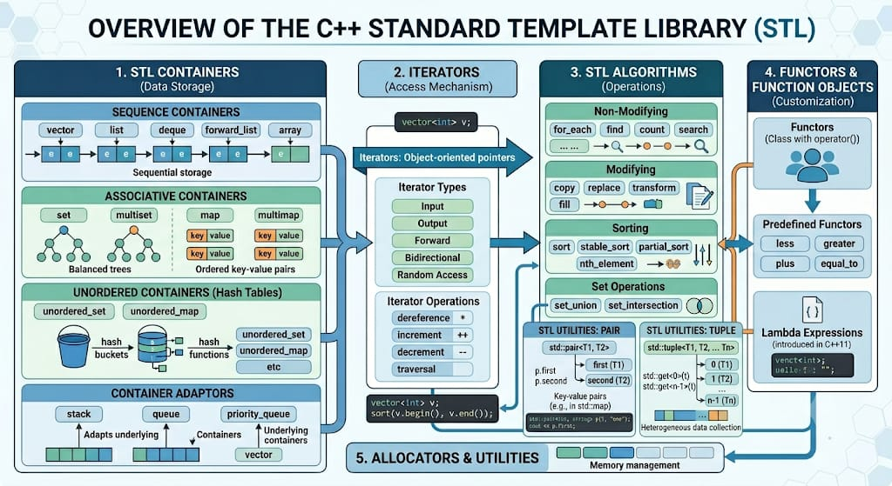

# C++ Standard Template Library (STL) - Complete Guide

The **C++ Standard Template Library (STL)** is a collection of template classes and functions that provide general-purpose classes and functions with templates that implement many popular and useful algorithms and data structures like queues, stacks, lists, and arrays. It is a powerful library that forms part of the C++ Standard Library and enables you to write efficient, reusable, and maintainable code.

---

## 🌍 Real-Life Scenario Example

**Scenario: E-Commerce Shopping Cart System with Advanced Features**

Imagine you're building an online shopping platform with sophisticated filtering and sorting:
- **Vector (Container)**: Store multiple products in a shopping cart
- **Algorithm (Sort)**: Sort products by price, rating, or discount using custom logic
- **Algorithm (Find)**: Search for a specific product quickly
- **Iterator**: Navigate through cart items efficiently
- **Functors**: Apply custom discount rules, validation logic, and price calculations

Instead of manually implementing all these features, STL provides ready-made, optimized solutions!

### Real-World Functor Use Cases in E-Commerce:
1. **PriceValidator Functor** - Validates if product price is within allowed range
2. **DiscountCalculator Functor** - Applies percentage-based or flat discounts
3. **PriceSorter Functor** - Sorts products by price with custom comparators
4. **TaxCalculator Functor** - Calculates regional taxes based on location

---

## 🔧 STL Overview



*The above image shows the components and overview of C++ STL in the single digram*

## 🔧 STL Components Overview

STL consists of **four main components**:

### 1. **Containers** 📦
*"Containers are template classes that manage collections of data with specific storage and access patterns."*

Data structures that hold elements:
- **Sequence Containers**: `vector`, `deque`, `list`, `forward_list`
- **Associative Containers**: `set`, `multiset`, `map`, `multimap`
- **Unordered Associative Containers**: `unordered_set`, `unordered_map`

#### Example:
```cpp
#include <iostream>
#include <vector>
using namespace std;

int main() {
    // Vector - Dynamic array container
    vector<int> numbers = {10, 20, 30, 40, 50};
    
    // Access elements
    cout << "First element: " << numbers[0] << endl;
    
    // Add element
    numbers.push_back(60);
    
    // Iterate through container
    for(int num : numbers) {
        cout << num << " ";
    }
    cout << endl;
    
    return 0;
}
```

**Output:**
```
First element: 10
10 20 30 40 50 60
```

---

### 2. **Iterators** 🔄
*"Iterators are objects that point to elements in a container and allow traversal and manipulation of data."*

Pointers that navigate through container elements:
- **Input Iterator**: Read-only, forward movement
- **Output Iterator**: Write-only, forward movement
- **Forward Iterator**: Read/write, forward movement
- **Bidirectional Iterator**: Read/write, forward and backward
- **Random Access Iterator**: Read/write, random access

#### Example:
```cpp
#include <iostream>
#include <vector>
using namespace std;

int main() {
    vector<string> fruits = {"Apple", "Banana", "Cherry", "Date"};
    
    // Forward iteration
    cout << "Forward iteration:" << endl;
    for(auto it = fruits.begin(); it != fruits.end(); ++it) {
        cout << *it << " ";
    }
    cout << endl;
    
    // Reverse iteration
    cout << "Reverse iteration:" << endl;
    for(auto it = fruits.rbegin(); it != fruits.rend(); ++it) {
        cout << *it << " ";
    }
    cout << endl;
    
    return 0;
}
```

**Output:**
```
Forward iteration:
Apple Banana Cherry Date 
Reverse iteration:
Date Cherry Banana Apple
```

---

### 3. **Algorithms** ⚙️
*"Algorithms are template functions that perform operations like sorting, searching, copying, and transforming container elements."*

Functions that operate on containers:
- **Sorting**: `sort`, `stable_sort`, `partial_sort`
- **Searching**: `find`, `binary_search`, `lower_bound`, `upper_bound`
- **Transformation**: `transform`, `copy`, `swap`, `reverse`
- **Aggregation**: `accumulate`, `count`, `max_element`, `min_element`

#### Example:
```cpp
#include <iostream>
#include <vector>
#include <algorithm>
using namespace std;

int main() {
    vector<int> data = {64, 34, 25, 12, 22, 11, 90};
    
    // Sort algorithm
    sort(data.begin(), data.end());
    cout << "Sorted: ";
    for(int x : data) cout << x << " ";
    cout << endl;
    
    // Find algorithm
    auto result = find(data.begin(), data.end(), 22);
    if(result != data.end()) {
        cout << "Element 22 found at index: " << (result - data.begin()) << endl;
    }
    
    // Transform algorithm - multiply each element by 2
    vector<int> doubled(data.size());
    transform(data.begin(), data.end(), doubled.begin(), 
              [](int x) { return x * 2; });
    
    cout << "Doubled: ";
    for(int x : doubled) cout << x << " ";
    cout << endl;
    
    // Count algorithm
    int count = ::count(data.begin(), data.end(), 22);
    cout << "Count of 22: " << count << endl;
    
    return 0;
}
```

**Output:**
```
Sorted: 11 12 22 25 34 64 90 
Element 22 found at index: 2
Doubled: 22 24 44 50 68 128 180 
Count of 22: 1
```

---

### 4. **Functors (Function Objects)** 🔧
*"Functors are classes with an overloaded operator() that allow objects to be called like functions, enabling customizable algorithm behavior."*

Objects that act like functions:

#### Example:
```cpp
#include <iostream>
#include <vector>
#include <algorithm>
using namespace std;

// Custom Functor
class MultiplyBy {
private:
    int factor;
public:
    MultiplyBy(int f) : factor(f) {}
    
    int operator()(int x) const {
        return x * factor;
    }
};

int main() {
    vector<int> numbers = {1, 2, 3, 4, 5};
    
    // Using functor with transform
    vector<int> result(numbers.size());
    transform(numbers.begin(), numbers.end(), result.begin(), 
              MultiplyBy(10));
    
    cout << "Multiplied by 10: ";
    for(int x : result) cout << x << " ";
    cout << endl;
    
    // Using lambda (modern alternative)
    vector<int> result2(numbers.size());
    transform(numbers.begin(), numbers.end(), result2.begin(), 
              [](int x) { return x * 10; });
    
    cout << "Using lambda: ";
    for(int x : result2) cout << x << " ";
    cout << endl;
    
    return 0;
}
```

**Output:**
```
Multiplied by 10: 10 20 30 40 50 
Using lambda: 10 20 30 40 50
```

---

## 🎯 Complete E-Commerce Example

```cpp
#include <iostream>
#include <vector>
#include <algorithm>
#include <iomanip>
using namespace std;

struct Product {
    string name;
    double price;
    int quantity;
    double discount;  // discount percentage
};

// Functor to validate product price
class PriceValidator {
private:
    double minPrice, maxPrice;
public:
    PriceValidator(double min, double max) : minPrice(min), maxPrice(max) {}
    
    bool operator()(const Product& p) const {
        return p.price >= minPrice && p.price <= maxPrice;
    }
};

// Functor to calculate discounted price
class DiscountCalculator {
public:
    double operator()(const Product& p) const {
        return p.price * (1 - p.discount / 100.0);
    }
};

// Functor to compare products by discounted price
class CompareByDiscountedPrice {
public:
    bool operator()(const Product& a, const Product& b) const {
        DiscountCalculator calc;
        return calc(a) < calc(b);
    }
};

// Functor to calculate total cost including quantity
class TotalCostCalculator {
public:
    double operator()(const Product& p) const {
        double discountedPrice = p.price * (1 - p.discount / 100.0);
        return discountedPrice * p.quantity;
    }
};

int main() {
    // Shopping cart with products
    vector<Product> cart = {
        {"Laptop", 999.99, 1, 10},      // 10% discount
        {"Mouse", 29.99, 2, 5},         // 5% discount
        {"Keyboard", 79.99, 1, 15},     // 15% discount
        {"Monitor", 299.99, 1, 20},     // 20% discount
        {"USB Cable", 9.99, 3, 0}       // no discount
    };
    
    cout << "╔═══════════════════════════════════════════════════╗" << endl;
    cout << "║        E-Commerce Shopping Cart System            ║" << endl;
    cout << "╚═══════════════════════════════════════════════════╝" << endl << endl;
    
    // Display original cart
    cout << "📦 Products in cart:" << endl;
    cout << setfill('-') << setw(65) << "" << endl;
    for(const auto& product : cart) {
        cout << "- " << left << setw(15) << product.name 
             << "Original Price: $" << fixed << setprecision(2) << setw(8) << product.price
             << " | Qty: " << product.quantity 
             << " | Discount: " << product.discount << "%" << endl;
    }
    cout << setfill('-') << setw(65) << "" << endl << endl;
    
    // FUNCTOR 1: Filter products by price range (using PriceValidator Functor)
    cout << "🔍 Products in price range $50 - $500:" << endl;
    vector<Product> priceFiltered;
    copy_if(cart.begin(), cart.end(), back_inserter(priceFiltered),
            PriceValidator(50, 500));
    
    for(const auto& p : priceFiltered) {
        cout << "  ✓ " << p.name << " - $" << p.price << endl;
    }
    cout << endl;
    
    // FUNCTOR 2: Sort by discounted price (using CompareByDiscountedPrice Functor)
    cout << "📊 Products sorted by discounted price:" << endl;
    vector<Product> sortedCart = cart;
    sort(sortedCart.begin(), sortedCart.end(), CompareByDiscountedPrice());
    
    DiscountCalculator discountCalc;
    for(const auto& product : sortedCart) {
        double originalPrice = product.price;
        double discountedPrice = discountCalc(product);
        cout << "  " << left << setw(15) << product.name 
             << "Original: $" << fixed << setprecision(2) << setw(8) << originalPrice
             << " → Discounted: $" << setw(8) << discountedPrice << endl;
    }
    cout << endl;
    
    // FUNCTOR 3: Calculate total for each product (using TotalCostCalculator Functor)
    cout << "💰 Total cost per product (with quantity and discount):" << endl;
    TotalCostCalculator totalCalc;
    double grandTotal = 0;
    
    for(const auto& product : cart) {
        double itemTotal = totalCalc(product);
        grandTotal += itemTotal;
        cout << "  " << left << setw(15) << product.name 
             << "Qty: " << product.quantity 
             << " → Total: $" << fixed << setprecision(2) << itemTotal << endl;
    }
    cout << setfill('-') << setw(65) << "" << endl;
    cout << "💵 GRAND TOTAL: $" << fixed << setprecision(2) << grandTotal << endl << endl;
    
    // FUNCTOR 4: Find products with discount >= 10% (using custom lambda with functor concept)
    cout << "🎁 Products with 10% or higher discount:" << endl;
    auto highDiscountProducts = cart;
    auto it = find_if(highDiscountProducts.begin(), highDiscountProducts.end(),
                     [](const Product& p) { return p.discount >= 10; });
    
    while(it != highDiscountProducts.end()) {
        cout << "  ⭐ " << it->name << " - " << it->discount << "% OFF" << endl;
        it = find_if(next(it), highDiscountProducts.end(),
                    [](const Product& p) { return p.discount >= 10; });
    }
    cout << endl;
    
    // Summary Statistics
    cout << "📈 Summary Statistics:" << endl;
    cout << "  Total items in cart: " << cart.size() << endl;
    cout << "  Total quantity: ";
    int totalQty = 0;
    for(const auto& p : cart) totalQty += p.quantity;
    cout << totalQty << " units" << endl;
    cout << "  Average discount: " << fixed << setprecision(2);
    double avgDiscount = 0;
    for(const auto& p : cart) avgDiscount += p.discount;
    cout << (avgDiscount / cart.size()) << "%" << endl;
    
    return 0;
}
```

**Output:**
```
╔═══════════════════════════════════════════════════╗
║        E-Commerce Shopping Cart System            ║
╚═══════════════════════════════════════════════════╝

📦 Products in cart:
-----------------------------------------------------------------
- Laptop          Original Price: $  999.99 | Qty: 1 | Discount: 10%
- Mouse           Original Price: $   29.99 | Qty: 2 | Discount: 5%
- Keyboard        Original Price: $   79.99 | Qty: 1 | Discount: 15%
- Monitor         Original Price: $  299.99 | Qty: 1 | Discount: 20%
- USB Cable       Original Price: $    9.99 | Qty: 3 | Discount: 0%
-----------------------------------------------------------------

🔍 Products in price range $50 - $500:
  ✓ Keyboard - $79.99
  ✓ Monitor - $299.99

📊 Products sorted by discounted price:
  USB Cable       Original: $    9.99 → Discounted: $    9.99
  Mouse           Original: $   29.99 → Discounted: $   28.49
  Keyboard        Original: $   79.99 → Discounted: $   67.99
  Monitor         Original: $  299.99 → Discounted: $  239.99
  Laptop          Original: $  999.99 → Discounted: $  899.99

💰 Total cost per product (with quantity and discount):
  Laptop          Qty: 1 → Total: $899.99
  Mouse           Qty: 2 → Total: $56.98
  Keyboard        Qty: 1 → Total: $67.99
  Monitor         Qty: 1 → Total: $239.99
  USB Cable       Qty: 3 → Total: $29.97
-----------------------------------------------------------------
💵 GRAND TOTAL: $1294.92

🎁 Products with 10% or higher discount:
  ⭐ Laptop - 10% OFF
  ⭐ Keyboard - 15% OFF
  ⭐ Monitor - 20% OFF

📈 Summary Statistics:
  Total items in cart: 5
  Total quantity: 8 units
  Average discount: 10.00%
```

---

## 🎯 Key Functor Use Cases in STL

| Functor Type | Purpose | STL Algorithm | Example |
|--------------|---------|---------------|---------|
| **Comparator** | Custom sorting logic | `sort`, `set` | `CompareByPrice` |
| **Validator** | Check conditions on elements | `find_if`, `remove_if` | `PriceValidator` |
| **Transformer** | Apply operations on elements | `transform`, `for_each` | `DiscountCalculator` |
| **Aggregator** | Accumulate/reduce elements | `accumulate`, `reduce` | `TotalCostCalculator` |

---

## 📊 STL Container Comparison

| Container | Time Complexity | Use Case |
|-----------|-----------------|----------|
| `vector` | O(1) access, O(n) insert | General purpose, fast access |
| `list` | O(n) access, O(1) insert | Frequent insertions/deletions |
| `map` | O(log n) all ops | Sorted key-value pairs |
| `unordered_map` | O(1) avg lookup | Fast key-value access |
| `set` | O(log n) all ops | Unique sorted elements |
| `queue` | O(1) enqueue/dequeue | FIFO operations |
| `stack` | O(1) push/pop | LIFO operations |

---

## ✨ Benefits of STL

✅ **Reusability** - Pre-built, tested components  
✅ **Efficiency** - Optimized algorithms and data structures  
✅ **Type-safe** - Template-based with compile-time checking  
✅ **Standardization** - Available across all C++ compilers  
✅ **Reduced Development Time** - No need to implement from scratch  
✅ **Flexibility** - Functors enable customizable behavior without modifying algorithms  

---

## 🚀 Key Takeaways

1. **STL provides powerful, efficient data structures and algorithms**
2. **Containers store data, Iterators navigate it, Algorithms process it, Functors customize behavior**
3. **Use STL to write cleaner, more maintainable C++ code**
4. **Functors enable reusable, stateful customization of algorithm behavior**
5. **Choose the right container based on access patterns and performance needs**
6. **Leverage algorithms with iterators and functors to solve complex problems efficiently**

---
